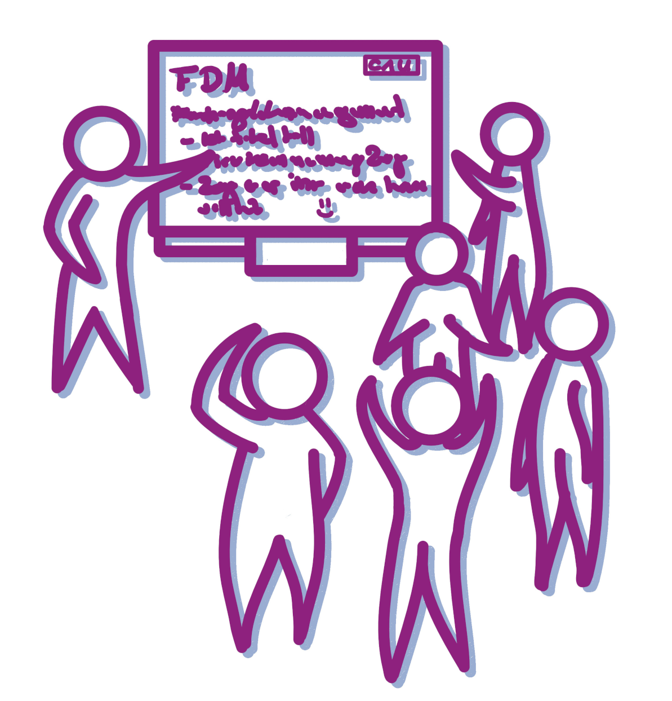
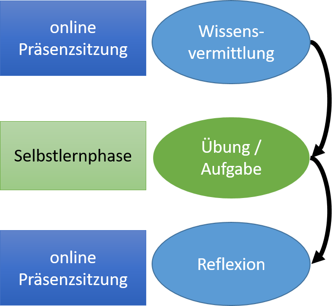
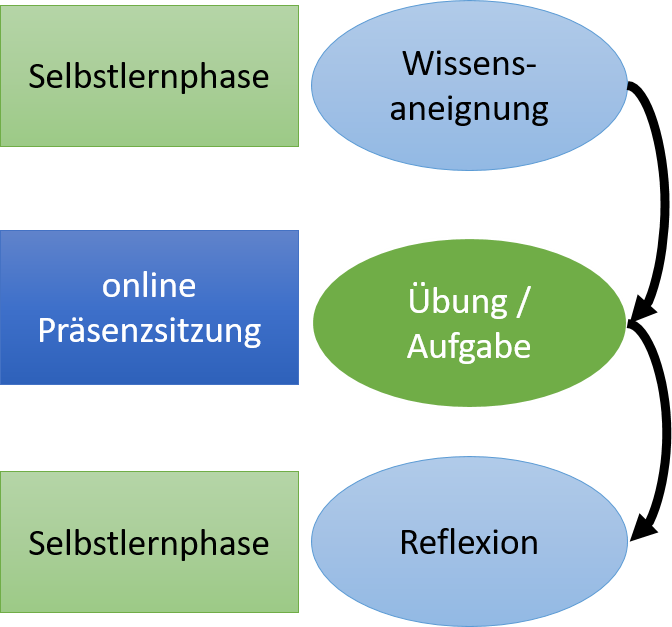
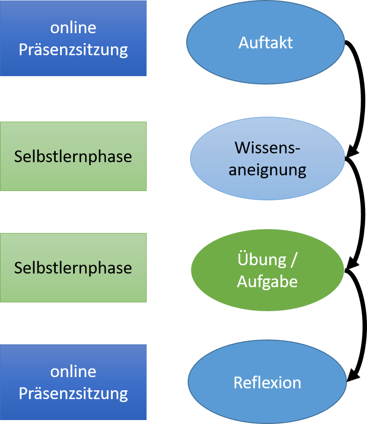
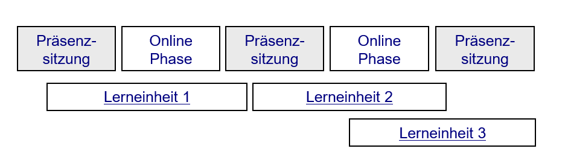
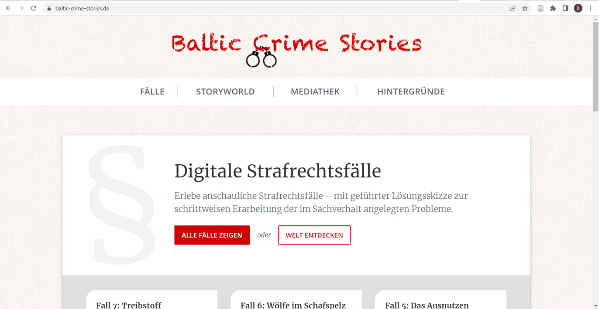
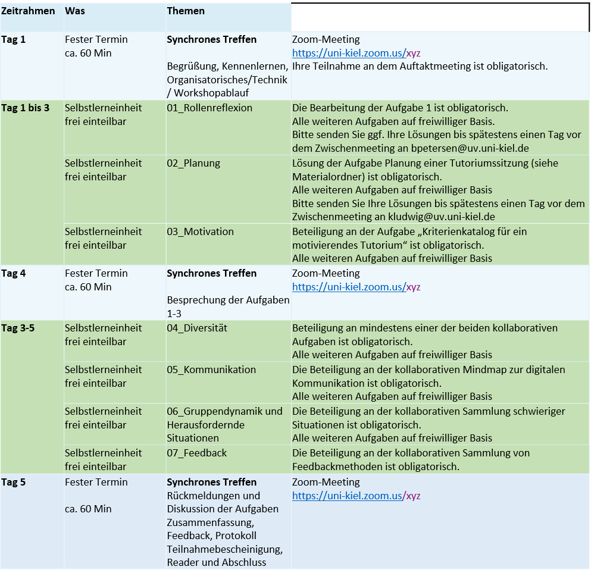

<!--

author:   Britta Petersen
email:    b.petersen@rz.uni-kiel.de
version:  0.1.0
language: en
narrator: UK English Female

icon:     images/Logo_cau-norm-de-lilagrey-rgb-0720_2022.png

comment:  This document provides a brief introduction to research data management for lecturers. It provides an overview of rdm related topics as well as some didactic and methodologies for teaching rdm to students.

-->

# Kurz-Input fdm@studium.nrw

2022-12-15

Britta Petersen, b.petersen@rz.uni-kiel.de

## Asynchrone Lehre / Blended Learning  

Unter Blended Learning wird die Verknüpfung von Elementen von traditionellen Präsenzveranstaltungen mit Elementen des elektronischen Lernens verstanden.

Synchrone und asynchrone Phasen werden miteinander verknüpft.

Ein e-Learning Baustein oder sonstige elektronisch verfügbaren Lernressourcen können sehr gut in asynchronen Phasen der Lehre zum Einsatz kommen.

Blended Learning kann in verschieden Szenarien durchgeführt werden.

**Blended Learning Szenarien\* am Beispiel e-Learning Baustein "*Forschungsdaten ordnen und strukturieren*":**

<SMALL>\*Abbildungen nach Bremer, C. (2009): Überblick über die Szenarien netzbasierten Lehrens und Lernens</SMALL>

---

{{1-2}}
********************************************************************************

**Präsenzphase - Selbstlernphase - Präsenzphase**

* **Präsenzsitzung**: Bedeutung von Dateibenennung kurz anteasern.
* **Selbstlernphase**: Durcharbeiten des e-Learning Bausteins, inkl. Arbeitsauftrag eine Dateibenennungskonvention zu entwickeln und in einer README-Datei zu dokumentieren (ggf. in Kleinguppenarbeit).
* **Präsenzsitzung**: Reflexion via Vorstellung ausgewählter README-Dateien, Diskussion im Plenum über Bedeutung von Dateibenennungskonventionen.

********************************************************************************

{{2-3}}
********************************************************************************

**Selbstlernphase - Präsenzphase -Selbstlernphase**

* **Selbstlernphase**: Bearbeitung des e-Learning Bausteins
* **Präsenzsitzung**: In Kleingruppenarbeit eine gemeinsame Dateibenennungskonvention entwickeln und in einer README-Datei dokumentieren.
* **Selbstlernphase**: Forumsdiskussion, Peer-Review

********************************************************************************

{{3-4}}
********************************************************************************

**Präsenzphase - Selbstlernphase - Selbstlernphase - Präsenzphase**

* **Präsenzsitzung**: Erläuterung der kommenden Aufgaben und der zugehörigen Lernziele
* **Selbstlernphase**: Neben anderen Recherche- und/oder Leseaufgaben Durcharbeiten des e-Learning Bausteins.
* **Selbstlernphase**: Neben anderen Arbeitsaufträgen Arbeitsauftrag eine Dateibenennungskonvention zu entwickeln und in einer README-Datei zu dokumentieren (ggf. in Kleinguppenarbeit).
* **Präsenzsitzung**: Reflexion via Vorstellung ausgewählter README-Dateien, Diskussion im Plenum über Bedeutung von Dateibenennungskonventionen.

********************************************************************************

{{4}}
********************************************************************************

Komplexere Lerneinheiten können sich auch über die verschiedenen Phasen erstrecken:

********************************************************************************

## Beispiele

{{1}}
********************************************************************************

**Baltic Crime Stories**

https://www.baltic-crime-stories.de/

---

* Interaktiv geführte Lösungen motivieren, Fälle zu "lösen" und nicht lediglich zu "lesen".

* Interaktive Fälle werden in asynchronen Phasen als Selbstlerneinheit bearbeitet.

* In eine Storyworld eingebettet erhöht der narrative Aufbau der Fälle  die Spannung und macht Freude beim Lernen.

* In synchronen Phasen können Studierende Fragen stellen und die Fälle diskutieren.

********************************************************************************

{{2}}
********************************************************************************

**Beat - be a tutor: Basisworkshop**

Corona machte die Umwandlung eines Präsenz-Tagesworkshops (7 Stunden) in eine Blended Learning Variante nötig:

* Vortragsanteile wurden eingesprochen / vertonte PPTs erstellt

* Aufgabenstellungen wurden in digitale Tools überführt (e. g. Zumpads/miro/learningapps.org)

* Vortragsanteile (vertonte PPTs) sowie Aufgabenstellungen via LMS bereitgestellt.

* Synchrone und asynchrone Phasen:

********************************************************************************

# Reflexion

 <!-- width="150px" align="right" -->

>* Welche Erfahrungen mit bringt Ihr in Bezug auf Blended Learning Lernszenarien mit?
>
>* Könnt Ihr von weiteren Beispielen/eigenen Erfahrungen berichten?
