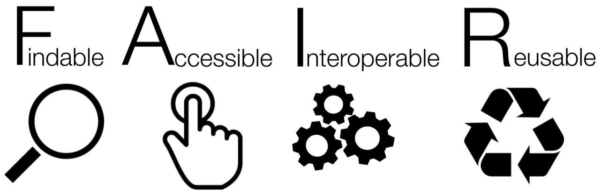

<!--
author:   Britta Petersen

email:    b.petersen@rz.uni-kiel.de

icon: images/Logo_cau-norm-de-lilagrey-rgb-0720_2022.png

version:  0.1.0

language: de

narrator: Deutsch Female

comment:  Präsentation zum Projektmeeting, 30.06.2022

tags:     Forschungsdaten, Forschungsdatenmanagement, FDM, eLBB4RDM, Vernetzungstreffen, Digi-Funds
-->

# e-Learning Building Blocks for Research Data Management (eLBB4RDM)

 <!-- width="350px" -->

# Ziele des Projektes

 <!-- width="100px" align="right" -->

* Interdisziplinäre, kollaborative Entwicklung von generischen e-Learning-Bausteinen für Bachelor- und Masterstudierende zum Themenspektrum FDM.
* Entwicklung von didaktischem Begleitmaterial: Beschreibung von möglichen Einsatzszenarien, Anregungen für fachspezifische Ergänzungsmöglichkeiten (z. B. Aufgabenstellungen, Anwendungsbeispiele)  
* Dissemination von Ergebnissen und Erfahrungen
* Bereitstellung entwickelter Materialien als OER

# Beteiligte

 <!-- width="100px" align="right" -->

{{1-2}}
********************************************************************************

**Mitantragstellende Projektpartner\*innen und Fachbereiche:**

* Prof. Dr. Nicola Fohrer und Dr. Georg Hörmann, Natur- und Ressourcenschutz
* Prof. Martina Gerken und Michael Meisser, Elektrotechnik
* Gregor Große-Bölting, Informatik
* Johannes Labrenz, Biowissenschaften
* Dr. Stefan Kratzenstein, Sportwissenschaften
* Prof. Dr. Oliver Nakoinz, Ur- und Frühgeschichte
* Thilo Paul-Stüve, Zentrales FDM

********************************************************************************

{{2-3}}
********************************************************************************

**Kooperationspartner\*innen:**

* Markus Alber, elk.Medien
* Andreas Christ, Universitätsbibliothek
* *Projekt: Bausteine für die digitale Lehre in den Geisteswissenschaften*

  * *Swantje Piotrowski, Historisches Seminar*
  * *Richard Diebel, Germanististisches Seminar*

********************************************************************************

{{3-4}}
********************************************************************************

**Beteiligte Studierende:**

* Cleo Michelsen (LA Biologie/Geographie)
* Semih Acis (Wirtschaftsinformatik)
* (Olaf Matthaei (LA Sport/Englisch))

********************************************************************************

# Aktivitäten

 <!-- width="100px" align="right" -->

{{0-1}}
********************************************************************************

**Projektstart**

* **Kick-Off Meeting**, Juni 2021
* Akquise von Hilfskräften, Juni – August 2021

********************************************************************************

{{1-2}}
********************************************************************************

**Workshops**

* Workshop **Train-the-Trainer zum Forschungsdatenmanagement**, Katarzyna Biernacka (HU Berlin), September 2021

  * In anschließenden Projektmeetings: Sammlung relevanter Themenaspekte / Formulierung von Lernzielen
  * Austausch zu technischen Umsetzungsmöglichkeiten, Testung und Auswahl von LiaScript
  * Einarbeitung in LiaScript und Git
  * Erarbeitung erster Inhalte

* Workshop **Erstellung von interaktiven, offenen Online-Kursen mit LiaScript** :-), Prof. Sebastian Zug (TU Freiberg) & André Dietrich, Mai 2022

********************************************************************************

{{2-3}}
********************************************************************************

**Pilotierung eines ersten Bausteins**

* Pilotierung eines ersten Bausteins "**Digitale Forschungsdaten ordnen und strukturieren**" in Lehrveranstaltungen der Geschichtswissenschaften (Dr. Swantje Piotrowski) und der Elektrotechnik (Porf. Dr. Martina Gerken) im Sommersemester 2022

  - Einsatz in den Geschichtswissenschaften -> Bearbeitung innerhalb der Lehrveranstaltungen
  - Einsatz in der Elektrotechnik -> freiwillige Hausaufgabe

* Auswertung der Evaluierung und Überarbeitung des Bausteins.

********************************************************************************

{{3-4}}
********************************************************************************

**Dissemination**

* Vorstellung des Projektes auf dem Jour Fix der Landesinitiative fdm.nrw, März 2022
* Beteiligung an der Erarbeitung der "Lernzielmatrix zum Themenbereich Forschungsdatenmanagement (FDM) für die Zielgruppen Studierende, PhDs und Data Stewards": https://zenodo.org/record/7034478#.Y2zr7XbMJPY

********************************************************************************

{{4-5}}
********************************************************************************

**Aktuell**

* Punktuelle Begleitung von Lehrveranstaltungen im WS 2022/23 sowie Erarbeitung weiterer Inhalte, erneuter Einsatz des Bausteins "**Digitale Forschungsdaten ordnen und strukturieren**"
* Begleitung des [**Projektseminars zur Geschichte der Neuzeit**](https://univis.uni-kiel.de/form?__s=2&dsc=anew/lecture_view&lvs=philos/histor/zentr/projek_1&anonymous=1&founds=philos/histor/zentr/aufbau_8,/bungim_94,/projek,/projek_1&nosearch=1&ref=main&sem=2022w&__e=341) (Projekt Modulare Bausteine für die digitale Lehre in den Geisteswissenschaften; Dr. Swantje Piotrowski) unter Nutzung des [Cloulab](https://cloudlab.rz.uni-kiel.de/) der CAU.

********************************************************************************

## Evaluation

Rückmeldungen zum Baustein "Forschungsdaten ordnen und strukturieren"

## Offene Rückmeldungen: Hilfreiche Inhalte

***Ich als Teilnehmende\*r empfand folgende Inhalte des Moduls als hilfreich:***

 <!-- width="100px" align="right" -->

- Der Inhalt selbst (also zur Datenorganisation) ist zweifellos sehr hilfreich. Auch die Idee der Lernüberprüfung durch Ankreuzen hilft sehr dabei sicherzustellen, dass man das gelesene auch ein wenig durchdrungen hat.
- Die Hinweise, wie vermieden werden kann eine Hausarbeit kurz vor Abgabe zu löschen, waren sehr hilfreich und haben mich zum Nachdenken angeregt. Der Baustein hat mich motiviert meine Datensicherungen zu checken und zu überarbeiten.
- Insbesondere die Strukturierung von Hausarbeiten etc., da ich selbst öfter mal das Problem hatte nicht die richtige finale Arbeit abgeschickt zu haben, weil ich nicht richtig geordnet habe.
- Die Quizfragen und das Arbeitsmaterial am Ende des Kurses.

## Offene Rückmeldungen: Verbesserungsvorschläge

***Ich als Teilnehmende\*r habe folgende Verbesserungsvorschläge für diese e-Learning-Einheit:***

 <!-- width="100px" align="right" -->

- Studienanfängern das Modul zeigen. Wer bis jetzt noch keine Ordnerstruktur hat, wird es vermutlich auch nicht mehr ändern.
- Auf die Apple User und deren Verzeichnissystem noch mal eingehen.
- Weniger textlastige Einheiten und mehr Interaktion.
- Eventuell ein bisschen weniger Umfang oder eine abschließende kurze Zusammenfassung mit den wichtigsten Punkten (muss auch nicht ausführlich sein).
- Weniger kleinschrittig

# Ansatz: Bausteinsystem

# Technische Umsetzung

{{1}}
********************************************************************************

********************************************************************************

{{2}}
********************************************************************************
**LiaScript**: https://liascript.github.io/

********************************************************************************

# Einbindungsmöglichkeiten in Olat

{{0-1}}
********************************************************************************

**Scorm Lernbaustein**

********************************************************************************

{{1-2}}
********************************************************************************

********************************************************************************

{{2-3}}
********************************************************************************

********************************************************************************

{{3-4}}
********************************************************************************

********************************************************************************

# Interessierte willkommen!

 <!-- width="100px" align="right" -->

> Menschen, die Interesse der Nutzung unserer Bausteine und/oder an der Mit- und Weiterentwicklung von Materialien haben sind sehr herzlich willkommen!
>
>**b.petersen@rz.uni-kiel.de**
