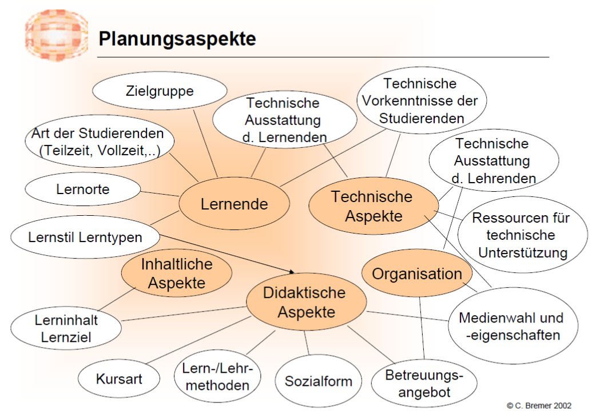
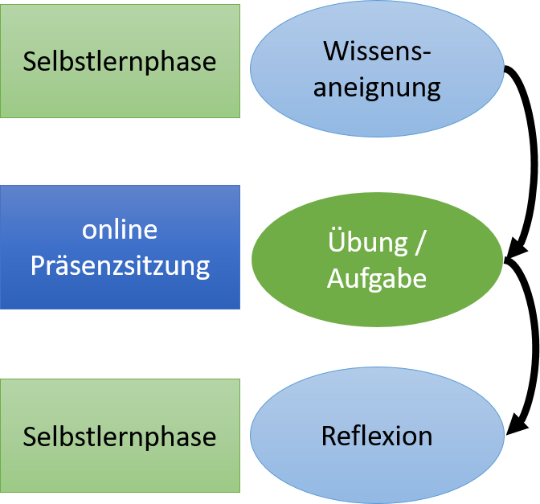
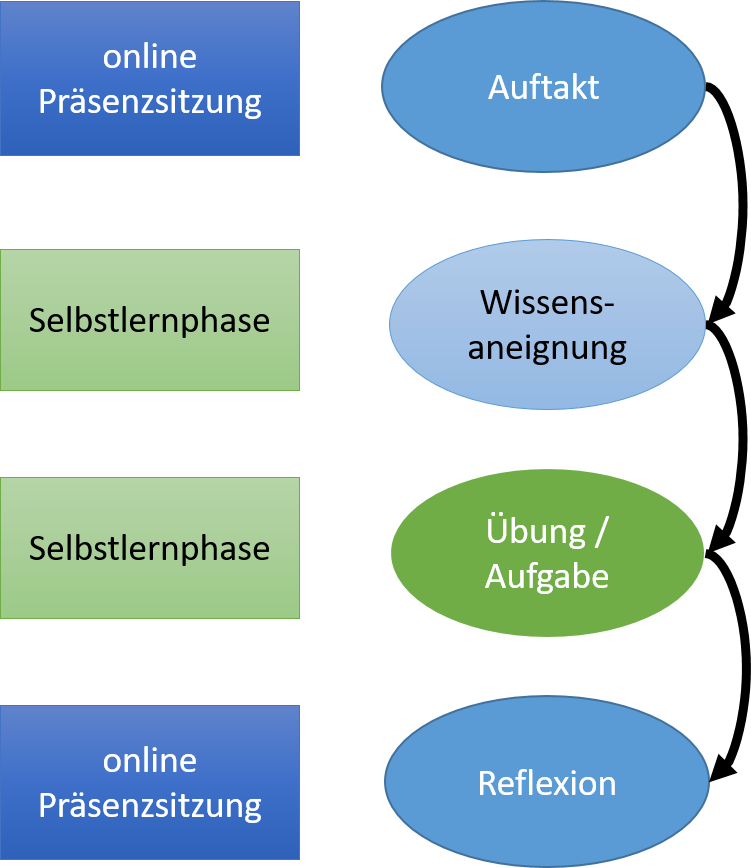
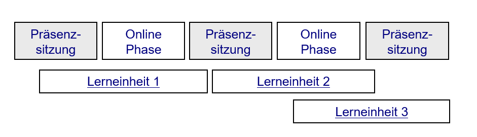
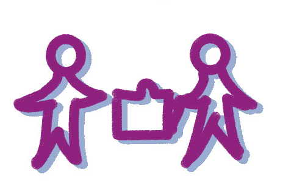
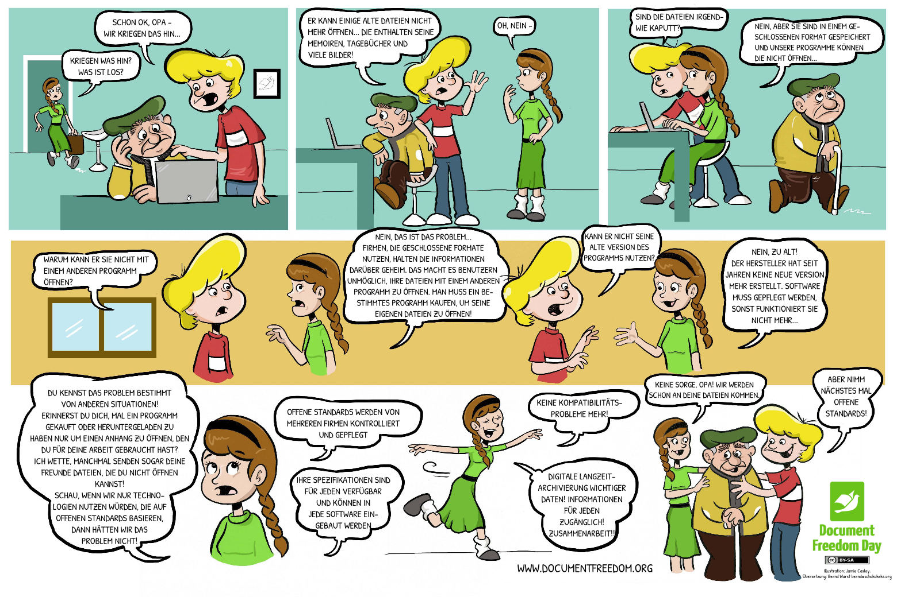

<!--

author:   Britta Petersen
email:    b.petersen@rz.uni-kiel.de
version:  0.1.0
language: en
narrator: UK English Female

icon:     images/Logo_cau-norm-de-lilagrey-rgb-0720_2022.png

comment:  This document provides a brief introduction to research data management for lecturers. It provides an overview of rdm related topics as well as some didactic and methodologies for teaching rdm to students.

-->

# Train-the-lecturer Forschungsdatenmanagement

TinyURL zu dieser Präsentation:

Zentrales Forschungsdatenmanagement, Britta Petersen, b.petersen@rz.uni-kiel.de

## Warm up

> **Lassen Sie uns zum Aufwärmen ein kleines Spiel spielen:**
>
> Bitte verdecken Sie Ihre Kamera mit einem Post-it oder einem Finger.
>
> Ich lese Aussagen vor.
>
> Bei jeder Aussage, der Sie zustimmen können, zeigen Sie sich bitte wieder und winken kurz in die Kamera.
>
> That's it !

{{1-2}}
********************************************************************************

>
Ich trinke morgens gerne Kaffee.

********************************************************************************

{{2-3}}
********************************************************************************

>
Ich bin hauptsächlich in der Lehre tätig.

********************************************************************************

{{3-4}}
********************************************************************************

>
Wenn ich mich entscheiden muss, ob ich ins Kino oder in ein Konzert gehe, entscheide ich mich wahrscheinlich für das Konzert.

********************************************************************************

{{4-5}}
********************************************************************************

>
Ich arbeite in einem naturwissenschaftlichen Bereich.

********************************************************************************

{{5-6}}
********************************************************************************

>
Ich arbeite in einem geisteswissenschaftlichen Bereich.

********************************************************************************

{{6-7}}
********************************************************************************

>
Ich kenne die FAIR-Prinzipien.

********************************************************************************

{{7-8}}
********************************************************************************

>
In meinen Lehrveranstaltungen werden bereits FDM-Aspekte behandelt.

********************************************************************************

{{8-9}}
********************************************************************************

>
Ich habe ein Haustier.

********************************************************************************

{{9-10}}
********************************************************************************

>
Ich nutze OER und/oder offene Daten in meinen Lehrveranstaltungen.

********************************************************************************

{{10-11}}
********************************************************************************

>
Ich habe eine ORCID.

********************************************************************************

{{11-12}}
********************************************************************************

>
Ich arbeite im medizinischen Bereich.

********************************************************************************

{{12-13}}
********************************************************************************

>
In meinen Lehrveranstaltungen wird programmiert.

********************************************************************************

## Workshop Regeln

 <!-- width="250px" align="right" -->

- Machen Sie auf sich aufmerksam, wenn Sie etwas sagen wollen.
- Fragen Sie bei Unklarheiten nach.
- Hören Sie sich gegenseitig zu und lassen Sie einander ausreden.
- Helfen Sie sich gegenseitig.
- Erledigen Sie möglichst nichts nebenbei.
- Beteiligen Sie sich aktiv.
- Fehler zulassen -> positive Fehlerkultur.
- Geben Sie Bescheid, wenn Sie eine Pause benötigen.

## Erwartungen an den Workshop

Ich würde gerne etwas mehr über Ihre Erwartungen und Befürchtungen in Bezug auf diesen Workshop erfahren.

Sie werden in Kleingruppen für 10 Minuten in Break-Out-Räumen zusammenkommen.

> **Stellen Sie sich einander kurz vor:**
>
>* Aus welchen Fachbereichen kommen Sie?
>* Welche Fachinhalte vermitteln Sie?
>
>Tauschen Sie sich in Ihrer Kleingruppe dazu aus, welche **Wünsche/Erwartungen** und welche **Befürchtungen** in Bezug auf diesen Workshop Sie mitbringen.
>
>* Sammeln Sie Ihre Punkte bitte auf **ONCOO-Karten**: https://www.oncoo.de/jzvb
>* Bestimmen Sie eine Person, die Ihre Diskussion im Plenum kurz zusammenfasst.  

### Review: Erwartungen an den Workshop

<iframe src="https://www.oncoo.de/t/jzvb" style="border:0px;width:100%;height:500px" allowfullscreen="true" webkitallowfullscreen="true" mozallowfullscreen="true"></iframe>

## Ziele dieses Workshops

 <!-- width="200px" align="right" -->

Ich möchte mit Ihnen erreichen, dass Sie am Ende des Workshops ...

* ... beschreiben können, welche Themenaspekte zum Themenkomplex FDM gehören.  
* ... beschreiben können, weshalb FDM für Forschungsprozesse und GWP von Bedeutung ist.
* ... Themenaspekte aus dem FDM identifizieren, die in die eigene Lehre integriert werden können.
* ... erste Ansätze und Ideen zur Integration von FDM-Aspekten in die eigene Lehre entwickeln.
* ... ausgiebig über Ansätze zur Integration von FDM-Themenaspekten in die Lehre reflektiert und diskutieren haben.
* ... auch ein bisschen Spaß hatten.

## Limitationen

 <!-- width="250px" align="right" -->

Aus zeitlichen Gründen werden wir heute nur einige grundlegende Aspekte dessen, was es über Inhalte und Methoden im Forschungsdatenmanagement zu wissen gibt, behandeln.

Wir werden uns keine speziellen Tools anschauen.

Fachspezifische Aspekte werden nicht behandelt, dürfen von Ihnen aber sehr gerne in die Diskussionen eingebracht werden.

Zum Ende des Workshops nehme ich gerne Ihre Wünsche für weiterführende/vertiefende Workshopthemen auf.

## Agenda

<!-- width="450px" align="right" -->

Unsere Agenda für heute

- Ankommen: Workshop Regeln, Warm-up, Erwartungen, Ziele und Limitationen
- Allgemeine didaktische Hinweise
- Überblick über das Themenspektrum FDM
- Nähere Betrachtung von einzelnen Themenaspekten
- Übungen ausprobieren und eigene Ideen/Übungen/Aufgabenstellungen entwickeln
- Lehr-/Lernmaterialien und Methoden suchen und finden
- Offene Fragen
- Feedback

---

** Wir machen eine Stunde Mittagspause**: 12:45 - 13:45 Uhr

# Allgemeine didaktische Hinweise

Bevor wir in das Thema Forschungsdatenmanagement einsteigen, einige allgemeine didaktische Hinweise:

## Rahmenbedingungen einer Lehrveranstaltung

## Phasen einer Lerneinheit

## Motivation & Aktivierung

{{0-3}}
********************************************************************************

**Die Motivation von Lernenden wird von der Erfüllung bestimmter Bedürfnisse bestimmt:**

********************************************************************************

{{1-2}}
********************************************************************************

********************************************************************************

{{2-3}}
********************************************************************************

********************************************************************************

{{3-9}}
********************************************************************************

**Aktivierung von Lernenden wirkt sich lernförderlich aus:**
---

********************************************************************************

{{4-5}}
********************************************************************************

")

********************************************************************************

{{5-6}}
********************************************************************************

")

**********************

{{6-7}}
********************************************************************************

")

**********************

{{7-8}}
********************************************************************************

")

**********************

## Planungshilfen

{{1-2}}
********************************************************************************
**Die 3-Z-Regel:**

********************************************************************************

{{2-3}}
********************************************************************************

**Planungsrater/Lehrdrehbücher**

********************************************************************************

# Forschungsdatenmanagement in der Lehre

 <!-- width="100px" align="right" -->

**Warum sollten wir den Themenkomplex FDM in die Lehre integrieren?**

--> Forschungsdatenmanagement und Data Literacy sind in allen wissenschaftlichen Disziplinen ein in den letzten Jahren immer mehr diskutiertes Thema.

--> Nachdem zunächst die Aus- und Weiterbildung von Forschenden und Infrastrukturmitarbeitenden im Bereich FDM fokussiert wurde, wird heute zunehmend eine Integration des Themenbereichs in die Lehre gefordert:

{{1-2}}
********************************************************************************

********************************************************************************

{{2-3}}
********************************************************************************

********************************************************************************

{{3-4}}
********************************************************************************

********************************************************************************

{{4}}
********************************************************************************

********************************************************************************

{{5}}
********************************************************************************

Es existieren auch Forderungen von Studierendenseite:

********************************************************************************

# Was ist das eigentlich: Forschungsdatenmanagement?

 <!-- width="100px" align="right" -->

**Was genau ist nun mit dem Begriff Forschungsdatenmanagement gemeint?**

Welche Inhaltsaspekte gehören eigentlich dazu? Lassen Sie uns kurz gemeinsam sammeln!

* Was denken Sie? Welche Inhaltsaspekte gehören zum Themenspektrum FDM?

<iframe src="https://answergarden.ch/2861448" style="border:0px;width:100%;height:500px" allowfullscreen="true" webkitallowfullscreen="true" mozallowfullscreen="true"></iframe>

## Orientierung Themenbereich FDM

 <!-- width="150px" align="right" -->

**Kleingruppenarbeit in Break-Outs:**
---
Überfliegen Sie die in der [Lernzielmatrix](https://zenodo.org/record/7034478#.Y4X_3HbMJPY) zum Themenbereich FDM aufgeführten Themenbereiche/Inhaltsaspekte und diskutieren Sie in Ihrer Gruppe:

* Decken sich die aufgeführten Aspekte mit Ihren Vorstellungen?
* Sind Aspekte aufgeführt, die Sie nicht erwartet hätten?
* Fehlen Ihnen bestimmte Aspekte?
* Wenn Sie an Ihre eigene Lehre denken, gibt es Aspekte, die bereits vermittelt werden?

---

Notieren Sie Stichpunkte zu Ihren Diskussionen in den zur Verfügung gestellten ZUM-Pads.

Bestimmen Sie eine Person, die Ihre Diskussion im Plenum kurz zusammenfasst.

Sie haben 10 Minuten Zeit.
---

### Begriffsdefinition Forschungsdatenmanagement

{{1}}
********************************************************************************
Das Portal **Forschungsdaten.info** definiert den Begriff **"Forschungsdatenmanagement"** folgendermaßen:

> Forschungsdatenmanagement (FDM) umfasst die Prozesse der **Transformation**, **Selektion** und **Speicherung** von Forschungsdaten mit dem gemeinsamen **Ziel**, diese *langfristig* und *personenunabhängig* **zugänglich**, **nachnutzbar** und **nachprüfbar** zu halten.
>
>(*forschungsdaten.info, letzter Zugriff 29.11.2022*)

********************************************************************************

### Begriffsdefinition Forschungsdaten

**Und was sind Forschungsdaten?**

{{2}}
********************************************************************************
Die **DFG** definiert den Begriff **"Forschungsdaten"** folgendermaßen:

> „Zu Forschungsdaten zählen u. a. Messdaten, Laborwerte, audiovisuelle Informationen, Texte, Surveydaten oder Beobachtungsdaten, methodische Testverfahren sowie Fragebögen. Korpora und Simulationen können ebenfalls zentrale Ergebnisse wissenschaftlicher Forschung darstellen und werden daher ebenfalls unter den Begriff Forschungsdaten gefasst. Da Forschungsdaten in einigen Fachbereichen auf der Analyse von Objekten basieren (z. B. Gewebe-, Material-, Gesteins-, Wasser- und Bodenproben, Prüfkörper, Installationen, Artefakte und Kunstgegenstände), muss der Umgang mit diesen ebenso sorgfältig sein und eine fachlich adäquate Nachnutzungsmöglichkeit, wann immer sinnvoll und möglich, mitgedacht werden. Ähnliches gilt, wenn Software für die Entstehung oder Verarbeitung von Forschungsdaten erforderlich ist.“
>
> (*DFG 2021*)

********************************************************************************

{{3}}
********************************************************************************

Etwas weniger kompliziert definierte das PrePARe Projekt der Camebridge University den Begriff **Forschungsdaten** als:

> “Any any information you use in your research.”
>
> (*University of Camebridge PrePARe Project*)

********************************************************************************

### Beispiele für Forschungsdaten

 <!-- width="350px" align="right" -->

- Audio- und Videoaufzeichnungen
- Tagebücher
- Daten aus geografischen Informationssystemen (GIS)
- Labor- und Feldnotizen
- Modell-, Skript- und Forschungssoftwarecode
- Bilder und Abbildungen
- Fragebögen und Codebücher
- Proben und Artefakte
- Sensor-Daten
- Sequenzierdaten
- Spektren
- Text- und Tabellenkalkulationsdokumente
- Textkorpora und Annotationen
- Topographie-Daten
- Abschriften

### Forschungsdatenlebenszyklus

 <!-- width="350px" align="right" -->

<SMALL>Illustration: Cleo Michelsen, basierend auf dem Forschungsdatenlebenszyklus des UK Data Service</SMALL>

{{1}}
********************************************************************************
 <!-- width="150px" align="right" -->

**Planung**:

* Auf welche Weise entstehen neue Daten?
* Werden Daten wiederverwendet?
* Welche Datentypen, im Sinne von Datenformaten (z. B. Bilddaten, Textdaten oder Messdaten in Tabellen) entstehen?
* Welche Analysen sind geplant?
* Welches Datenvolumen ist zu erwarten?
* Welche rechtlichen und ethischen Aspekte müssen berücksichtigt werden?
* Wer ist verantwortlich?

---

********************************************************************************

{{2}}
********************************************************************************
 <!-- width="150px" align="right" -->

**Erhebung und Analyse**:

* Welche Ansätze werden verfolgt, um die Daten nachvollziehbar zu dokumentieren?
* Welche Maßnahmen werden getroffen, um eine hohe Qualität der Daten zu gewährleisten?
* Welche digitalen Methoden und Werkzeuge (z. B. Software) sind zur Nutzung und Analyse der Daten erforderlich?
* Auf welche Weise werden die Daten während der Projektlaufzeit gespeichert und gesichert?
* Wie wird die Sicherheit sensibler Daten während der Projektlaufzeit gewährleistet (Zugriffs- und Nutzungsverwaltung)?

********************************************************************************
---

{{3}}
********************************************************************************

 <!-- width="150px" align="right" -->

**Archivierung & Veröffentlichung**:

* Welche rechtlichen Besonderheiten bestehen im Zusammenhang mit dem Umgang mit Forschungsdaten in dem Forschungsprojekt?
* Sind Auswirkungen oder Einschränkungen in Bezug auf die spätere Veröffentlichung bzw. Zugänglichkeit zu erwarten?
* Auf welche Weise werden nutzungs- und urheberrechtliche Aspekte sowie Eigentumsfragen berücksichtigt?
* Existieren wichtige wissenschaftliche Kodizes bzw. fachliche Normen, die Berücksichtigung finden sollten?

---
********************************************************************************

{{4}}
********************************************************************************

 <!-- width="150px" align="right" -->

**Nachnutzung**:

* Welche Daten bieten sich für eine Nachnutzung besonders an?
* Nach welchen Kriterien werden Forschungsdaten ausgewählt, um diese für die Nachnutzung durch andere zur Verfügung zu stellen?
* Planen Sie die Archivierung Ihrer Daten in einer geeigneten Infrastruktur?
* Falls ja, wie und wo? Gibt es Sperrfristen?
* Wann sind die Forschungsdaten für Dritte nutzbar?

********************************************************************************

### Ziel: FAIRe Daten

Daten langfristig und personenunabhängig zugänglich, nachnutzbar und nachprüfbar halten.
---

.")

{{1}}
********************************************************************************

********************************************************************************

### Welchen Nutzen hat Forschungsdatenmanagement?

 <!-- width="150px" align="right" -->

**Tauschen Sie sich bitte kurz mit einer anderen teilnehmenden Person aus.**

* Gutes Forschungsdatenmanagement gilt als ein Teil **~~guter wissenschaftlicher Praxis~~ (GWP)**. Inwiefern kann FDM zu GWP beitragen? Welchen Nutzen kann ein gutes Forschungsdatenmanagement darüber hinaus haben?

Sie werden für drei Minuten mit einem/einer Partner\*in in die Break-Out-Räume geschickt.

{{1}}
********************************************************************************
>**Gutes Forschungsdatenmanagement trägt bei zu ...**
>
> - Reproduzierbarkeit von Ergebnissen (GWP)
> - Rückverfolgbarkeit und Transparenz der Forschung (GWP)
> - gute Auffindbarkeit von Daten, z. B. durch aussagekräftige Benennung und beschreibende Metadaten
> - Wissenserhalt – Daten sollen unabhängig von einzelnen Menschen, Projekten oder Institutionen zugänglich sein (GWP)
> - Erleichterung der Zusammenarbeit
> - Vorbeugung von Datenverlusten
> - Kostenersparnis, z. B. durch Nachnutzung statt neuer Erhebung
> - Transfer der Daten in zukünftige Projekte
> - Erhöhung der Sichtbarkeit der eigenen Arbeit durch Forschungsdatenzitation
> - Erfüllung von Auflagen der Drittmittelgeber
> - ….

********************************************************************************
# Erste Schritte im FDM

Wir werden uns im Folgenden eine Auswahl an Themenaspekten näher anschauen:

* Forschungsdaten ordnen und strukturieren
* Versionierung
* Forschungsdaten dokumentieren
* Dateiformate
* FAIR-Prinzipien
* Nachnutzung von Forschungsdaten

## Strukturierte Ordner- und Dateibenennung

>
**Es mag banal erscheinen, aber eine strukturierte Ordner- und Dateibenennung ist ein erster Schritt im Forschungsdatenmanagement!**

<SMALL>https://xkcd.com/1459. Shared under CC-BY-NC License</SMALL>

---
{{1}}
********************************************************************************

* Haben Sie sich schon mal über sich selbst geärgert, weil Sie bestimmte Dateien nicht oder nur mit großem Aufwand finden konnten?

* Sind Ihnen vielleicht sogar schon mal Daten verloren gegangen, weil Dateien versehentlich überschrieben wurden?

---

********************************************************************************

{{2}}
********************************************************************************

Ordner und Dateien sollten systematisch benannt und geordnet sein, damit

* die Dateien jetzt und in Zukunft leicht auffindbar und zugänglich sind,
* längeres Suchen von Dateien oder das Vergleichen verschiedener Versionen von Dateien vermieden wird,
* Änderungen nachvollziehbar sind,
* die Dateien nicht versehentlich gelöscht oder überschrieben werden,
* um die Zusammenarbeit zu verbessern und
* Automatisierungsprozesse zu ermöglichen.

********************************************************************************

### Ordnerstrukturen

Folgende Punkte können bei der Erstellung einer günstigen Ordnerstruktur helfen:

{{1}}
********************************************************************************

* Ordner fassen Dateien mit gemeinsamen Eigenschaften zusammen

  * Mögliche Ordnungskategorien: Teilprojekte, Arbeitspakete, Datum oder Zeitraum (z. B. Monate, Quartale), Datentypen, Datenanalysen, Literatur, Formate, ...
  {{2}}
* Beschreibende Ordnernamen verweisen auf die Inhalte
{{3}}
* Ordner sind hierarchisch strukturiert
{{4}}
* Es sind nicht zu viele Unterordner angelegt worden (Pfadlänge)
{{5}}
* Laufende und abgeschlossene Arbeiten werden getrennt
{{6}}
* Rohdaten werden gesondert abgelegt
{{7}}
* Es gibt eine Zwischenablage, die regelmäßig aufgeräumt wird -->
{{8}}
* Nicht mehr benötigte Dateien werden regelmäßig gelöscht

---

********************************************************************************

{{9}}
********************************************************************************

Es gilt außerdem:

* Ausprobieren und anpassen
* Dokumentieren/Dokumentation bei Änderungen anpassen
* Für gemeinsam genutzte Dateien gemeinsame Regeln festlegen
* Konsequent bleiben

********************************************************************************

{{10}}
********************************************************************************
Beispiel Ordnerstruktur:

<!-- width="350px" -->

********************************************************************************

### Dateibenennung

Die Art und Weise der Benennung von Dateien ist ein wichtiger Baustein im Forschungsdatenmanagement.

Folgende Punkte können bei der Erstellung günstiger Dateinamen helfen:

{{1}}
* Weniger als 32 Zeichen (besser noch weniger) für Dateinamen benutzen
{{2}}
* Dateinamen sollten deutlich auf den Inhalt der Datei hinweisen
{{3}}
* Grundsätzlich keine unspezifischen Dateinamen (untitled3746.cvs, protokoll-final.docx) verwenden
{{4}}
* Keine Sonderzeichen, Umlaute oder Leerzeichen in Dateinamen benutzen
{{5}}
* Erlaubte Sonderzeichen sind Unterstrich ( _ ) und Bindestrich ( - )
{{6}}
* Führende Null(en) bei Nummerierungen verwenden
{{7}}
* Datumsangaben nach der ISO 8601 (YYYYMMDD oder YYYY-MM-DD oder YYYY_MM_DD)

{{8}}
********************************************************************************

**Es gilt außerdem:**

* Prüfen, ob bereits etablierte Dateibenennungskonventionen existieren
* eigene Benennungsregeln in einer Dateibenennungskonvention festhalten
* Konventionen möglichst frühzeitig festlegen
* Unterschiedliche Konventionen für verschiedene Dateitypen sind erlaubt
* Dokumentieren/Dokumentation bei Änderungen anpassen

********************************************************************************

{{9}}
********************************************************************************
Beispiele für Benennungskonventionen:

********************************************************************************

### Aktivität: Ordner- und Dateibenennung

>
**Haben Sie sich schon mal über die Dateinamen von bei Ihnen eingereichten Hausarbeiten oder sonstigen abgabepflichtigen Aufgaben geärgert?**

>**Einzelarbeit** (gerne auch in Partnerarbeit, falls Sie eine Veranstaltung gemeinsam durchführen)
>
>Denken Sie bitte an eine Ihrer Lehrveranstaltungen, in der Studierende die Bearbeitung von Aufgaben in Form von Dateien bei Ihnen einreichen müssen. Bitte erstellen Sie eine Dateibenennungskonvention, die Ihren Studierenden vorgibt, in welcher Form die abzugebenden Dateien benannt werden sollen.
>
>Bitte dokumentieren Sie in Form einer README-Datei
>
>1. für welche Dateien Ihre Namenskonvention gilt,
>2. die zu benennenden, beschreibenden Namensaspekte und deren Reihenfolge sowie
>3. die ggf. zu verwendenden Abkürzungen.  

### e-Learning: Ordner- und Dateibenennung

https://tinyurl.com/dateibenennung

## Asynchrone Lehre / Blended Learning  

Ein e-Learning Baustein, wie das eben gezeigte Beispiel, oder sonstige Lernressourcen können gut in asynchronen Phasen der Lehre zum Einsatz kommen.

Asynchrone Lehre, auch als Blended Learning bekannt, kann in verschiedenen Szenarien durchgeführt werden.

**Blended Learning Szenarien\* am Beispiel e-Learning Baustein Ordnung und Struktur:**

<SMALL>\*Abbildungen nach Bremer, C. (2009): Überblick über die Szenarien netzbasierten Lehrens und Lernens</SMALL>

---

{{1-2}}
********************************************************************************

**Präsenzphase - Selbstlernphase - Präsenzphase**

* **Präsenzsitzung**: Bedeutung von Dateibenennung kurz anteasern.
* **Selbstlernphase**: Durcharbeiten des e-Learning Bausteins, inkl. Arbeitsauftrag eine Dateibenennungskonvention zu entwickeln und in einer README-Datei zu dokumentieren (ggf. in Kleingruppenarbeit).
* **Präsenzsitzung**: Reflexion via Vorstellung ausgewählter README-Dateien, Diskussion im Plenum über Bedeutung von Dateibenennungskonventionen.

********************************************************************************

{{2-3}}
********************************************************************************

**Selbstlernphase - Präsenzphase -Selbstlernphase**

* **Selbstlernphase**: Bearbeitung des e-Learning Bausteins
* **Präsenzsitzung**: In Kleingruppenarbeit eine gemeinsame Dateibenennungskonvention entwickeln und in einer README-Datei dokumentieren.
* **Selbstlernphase**: Forumsdiskussion, Peer-Review

********************************************************************************

{{3-4}}
********************************************************************************

**Präsenzphase - Selbstlernphase - Selbstlernphase - Präsenzphase**

* **Präsenzsitzung**: Erläuterung der kommenden Aufgaben und der zugehörigen Lernziele
* **Selbstlernphase**: Neben anderen Recherche- und/oder Leseaufgaben Durcharbeiten des e-Learning Bausteins.
* **Selbstlernphase**: Neben anderen Arbeitsaufträgen Arbeitsauftrag eine Dateibenennungskonvention zu entwickeln und in einer README-Datei zu dokumentieren (ggf. in Kleingruppenarbeit).
* **Präsenzsitzung**: Reflexion via Vorstellung ausgewählter README-Dateien, Diskussion im Plenum über Bedeutung von Dateibenennungskonventionen.

********************************************************************************

{{4}}
********************************************************************************

Komplexere Lerneinheiten können sich auch über die verschiedenen Phasen erstrecken:

********************************************************************************

## Versionierung

{{0-1}}
********************************************************************************

********************************************************************************

{{1-2}}
********************************************************************************

>* Um verschiedene Stadien der Bearbeitung von Dateien nachvollziehen und unterscheiden zu können, sollte eine konsequente Versionierung vorgenommen werden.
>
>* Das Vorgehen bei der Versionierung sollte allen, die gemeinsam an Datenmaterial arbeiten bekannt sein.
>
>* Versionierungen können im Dateinamen vorgenommen werden und die Vorgehensweise gemeinsam mit der Dokumentation zu Ordnerstruktur und Dateibenennung in einer README-Datei dokumentiert werden.
>
>* In einer **Versionskontrolltabelle** kann eine Dokumentation der vorgenommenen Änderungen erfolgen.
>
> * 
***Rohdaten immer separat und ggf. schreibgeschützt abspeichern***

********************************************************************************

{{2-3}}
********************************************************************************

**Versionierung im Dateinamen:**

Die Versionierung kann als Bestandteil des Dateinamens definiert werden und dabei zwischen größeren und kleineren Änderungen unterscheiden:

* Beispiel für größere Änderungen = Beispieldatei\_v1 -> Beispieldatei_v2
* Beispiel für kleinere Änderungen = Beispieldatei\_v1.1 -> Beispieldatei\_v1.2
* Beispiel für Major.Minor.Sub-Minor = Beispieldatei\_v0.1.0 -> Beispieldatei\_v0.1.1

>
**Unspezifische Bezeichnungen bitte vermeiden!**

>
>* ~original1~
>* ~neu~
>* ~bearbeitung2~
>* ~final~
>* ~final_2~

********************************************************************************

{{3-4}}
********************************************************************************

**Beispiel für eine Versionskontrolltabelle**

| Versionsnr.  | Änderungen                       | Datum      | Bearbeitung durch |
| :----------  | :----------                      | ---        | ---               |
| 1.0          | Freigabe                         | 2016-11-2  | KL                |
| 1.1          | Verbesserung Rechtschreibfehler  | 2016-11-20 | KL                |
| 1.2          | Änderungen am Layout             | 2017-02-20 | GN                |
| 2.0          | Neues Kapitel (3.1.) hinzugefügt | 2017-02-20 | GN                |

Eine Versionskontrolltabelle kann innerhalb des bearbeiteten Dokuments oder als separate Datei angelegt werden.

********************************************************************************

{{4-5}}
********************************************************************************
**Beispiel für eine Versionsinformation innerhalb eines Dokuments:**

********************************************************************************

{{5}}
********************************************************************************

**Beispiel dokumentiertes Versionierungsschema:**

https://zenodo.org/record/6076538#.Y4pE63bMJPa

********************************************************************************

### Softwaregestützte Versionierung

Es gibt eine Reihe von nützlichen Tools, die Ihnen helfen, insbesondere textbasierte Daten und Forschungsdatencode zu verfolgen und zu versionieren.

Die am weitesten verbreiteten basieren auf dem Versionsverwaltungssystem Git und umfassen unter anderem:

* GitHub: https://github.com
* GitLab: https://about.gitlab.com
* Bitbucket: https://bitbucket.org
* Gitea: https://gitea.io/en-us

#### Gitlab RZ CAU

> **Das Rechenzentrum betreibt einen zentral den Git-Dienst [Gitlab RZ CAU](https://cau-git.rz.uni-kiel.de/) für die Einrichtungen der CAU.**
>
> Der Dienst basiert auf einer speziellen GitLab-Installation.
>
> Der Dienst ist unter [https://cau-git.rz.uni-kiel.de/](https://cau-git.rz.uni-kiel.de/) aufrufbar.

{{1}}
********************************************************************************

**Zu den Funktionen gehören unter anderem:**

- Die Bereitstellung einer Versionsverwaltung auf Basis von Git.
- Eine Administrationsoberfläche für die dezentrale Vergabe von Rechten.
- Ein Webinterface für die Zusammenarbeit an Projekten auf Basis von GitLab, inkl.

  - Verwaltung von mehreren Entwicklungszweigen
  - Issue-Management
  - integriertes Wiki

********************************************************************************

{{2}}
********************************************************************************

**Registrierung:**

Die Registrierung erfolgt mit der Kennung für allgemeine Dienste.

Eine explizite Aktivierung ist für die Registrierung nicht erforderlich.

Dies gilt auch für Studierende.

********************************************************************************

{{3}}
********************************************************************************

**Beantragung Projektgruppe:**

Das Rechenzentrum der Universität Kiel richtet auf Antrag Projektgruppen ein.

- Antragsberechtigt sind die Leiterinnen und Leiter der dem Rechenzentrum bekannten Einrichtungen.
- Für jede Projektgruppe können ein oder mehrere Administratoren definiert werden, die zunächst neuen Projektgruppen zugeordnet werden.
- Innerhalb der Projektgruppen können die Gruppenadministratoren selbständig

  - neue Projekte anlegen
  - Projekte löschen
  - Rechte an beliebige Benutzer (mit gültiger RZ-LDAP-Kennung) vergeben

- Die weitere Verwaltung von Rechten an untergeordneten Gruppen und Projekten erfolgt durch die Projektadministratoren.

********************************************************************************

{{4}}
********************************************************************************

**Login**

> **Die Login-Seite von [Gitlab RZ CAU](https://cau-git.rz.uni-kiel.de) finden Sie unter [https://cau-git.rz.uni-kiel.de/users/sign_in](https://cau-git.rz.uni-kiel.de/users/sign_in).**
>
> Um sich anzumelden, benötigen Sie
>
> - RZ-LDAP-Benutzername (z.B. *szrzs123*, *sughi456* usw.)
> - Kennwort
>
> Studierende, benötigen
>
> - stu-Kennung (z.B. *stu208876*)
> - Kennwort
>
> 
***Studierende wie Mitarbeitende müssen sich ein erstes Mal eingeloggt haben, bevor sie von Betreuern auffindbar sind und Projekten hinzugefügt werden können!***

********************************************************************************

## Reflexion

> <!-- width="150px" align="right" -->
>
>**Kleingruppenarbeit**
>
>* Bitte tauschen Sie sich in Ihrer Gruppe darüber aus, in welchen Ihrer Lehrzusammenhänge die Thematisierung von Ordnerstrukturen, Dateibenennung und Dateiversionierung (einfach oder toolgestützt) integriert werden könnte.
>* Haben Sie Ideen für mögliche Aufgabenstellungen?
>
>Sie haben zehn Minuten für den Austausch in den Break-Out-Räumen.
>
>Bitte dokumentieren Sie Ihre Ideen auf dem Miro-Board:

## Datendokumentation & Datenqualität

>
*Die Qualität von Daten zeichnet sich in der Wissenschaft unter anderem durch Transparenz und Nachvollziehbarkeit der Datensätze aus. Entsprechend der FAIR-Prinzipien sollten die Daten auffindbar (findable), zugänglich (accessible), interoperabel (interoperable) und wiederverwendbar (reusable) sein. Für die (Nach-)Nutzung von Forschungsdaten ist es wichtig, dass sie nicht nur methodisch korrekt erhoben, sondern auch gut dokumentiert vorliegen. Nur so ergeben sich im wissenschaftlichen Arbeiten valide Ergebnisse, die möglichst replizierbar sind.*

>
>
<SMALL>[Bundesministerium für Bildung und Forschung](https://www.bildung-forschung.digital/digitalezukunft/de/wissen/forschungsdaten/datenqualitaet-in-der-wissenschaft-sichern/datenqualitaet-in-der-wissenschaft-sichern_node.html) (2019): Datenqualität in der Wissenschaft sichern.</SMALL>

{{1}}
********************************************************************************

>**Ohne Dokumentation laufen wir Gefahr**
>
>* Daten nicht wiederzufinden
>* die Entstehung von Daten nicht mehr nachvollziehen zu können
>* Daten wegen fehlender Kontextinformationen nicht mehr interpretieren zu können
>* Dateien zu verwechseln (veraltete oder konkurrierende Versionen)
>* Daten nicht mit anderen Personen austauschen oder mit Daten aus anderen Quellen zusammenführen zu können

********************************************************************************

### Aktivität - Datendokumentation & Datenqualität

> <!-- width="150px" align="right" -->
>
>**Kleingruppenarbeit**
>
>Sie erhalten einen Datensatz in Form einer Excel-Tabelle von einem Kollegen.
>
>Bitte diskutieren Sie in Ihrer Gruppe:
>
>* Welche zusätzlichen Informationen benötigen Sie, um mit diesem Datensatz arbeiten zu können?
>* Was fällt Ihnen hinsichtlich der Datenqualität an diesem Datensatz auf?
>
>Notieren Sie die wichtigsten Punkte Ihrer Diskussion bitte auf dem Miro-Board:
>
>Die Excel-Datei Ihres Kollegen finden Sie hier: <A HREF="downloads/average_d.xlsx" download>average_d.xlsx</A> oder auf dem Miro-Board.

### Grundlegende Bestandteile einer Datendokumentation

**Eine gute Datendokumentation enthält Informationen zu:**

* Kontext: Projekthistorie, Absicht/ Zielsetzung, Hypothesen, ...
* Methoden: Sampling, Umstände der Erhebung, technische Rahmenbedingungen, ...
* Datenstrukturen, Beziehungen zwischen Objekten
* Wertebereiche, Qualitätskriterien, Gültigkeit
* Änderungen im Projektverlauf, Versionierung
* Informationen zum Zugang und Nutzungsbedingungen

---

**Fokus Datenqualität**:

* Erläuterung der verwendeten Terminologie, ggf. Definitionen / kontrollierten Vokabularen und Ontologien bzw. Thesauri
* ggf. vordefinierte Wertebereiche, Format-vorgaben (z.B. Datum YYYY-MM-DD)
* Aussagekräftige Bezeichnungen von Spaltenköpfen (Sonderzeichen vermeiden)
* Namen, Bezeichnungen für Variablen, Einheiten und ihre Werte dokumentieren
* Erklärungen für Codes /Klassifikationsschemata
* Kodierung fehlende Werte / Gründe für fehlende Werte
* Abgeleitete Daten, verwendete Algorithmen, Gewichtungen ...

### Reflexion: Datendokumentation & Datenqualität

> <!-- width="150px" align="right" -->
>
>**Kleingruppenarbeit**
>
>Diskutieren Sie in welchen Zusammenhängen Ihrer eigenen Lehre die Thematisierung der Aspekte Datendokumentation und Datenqualität sinnvoll und passend wäre.
>
>Brainstormen Sie zu möglichen Sensibilisierungsübungen und Aufgabenstellungen. Notieren Sie diese auf dem Miro-Board:

## Formate

{{1}}
********************************************************************************

**Warum ist es relevant, sich über genutzte Dateiformate Gedanken zu machen?**

********************************************************************************

{{2}}
********************************************************************************

**Bzgl. Interoperabilität und Nachnutzbarkeit empfehlenswerte Datenformate:**

********************************************************************************

### Aktivität: Datenformate

> <!-- width="150px" align="right" -->
>
>**Kleingruppenarbeit**
>
>Entwickeln Sie in Ihrer Gruppe eine eigene kurze "Story" (in Stichworten), die die Bedeutung der Wahl von Dateiformaten in einem wissenschaftlichen oder hochschulbezogenen Kontext thematisiert und z. B. als Einstieg in eine Lerneinheit "Formate" dienen könnte.

## World-Café: Themen-Potpourri

<!-- width="350px" align="right" -->

{{1-2}}
********************************************************************************

Das World-Cafe ist eine aktivierende Methode aus der Präsenzlehre, kann aber in den virtuellen Raum übertragen werden.

**Rolle der Lehrperson**: erläutern, anregen, begleiten

**Rolle der Lernenden:**: reflektieren, diskutieren, argumentieren, aktiv an Gesprächen teilnehmen und Gesprächsrunden leiten

**Online Break-Out statt Tisch**:
Anstelle der Gruppenarbeit an Tischen werden Break-Out Räume erstellt
Als „Flipchart-Ersatz“ eignet sich z. B. das Conceptboard. Einfache Pads (z. B. ZUM-Pad, EduPad) funktionieren aber auch.

**Ablauf virtuell**:
Erläuterung der Methode World-Cafe sowie kurze Vorstellung der Diskussionsthemen und Benennung der Gastgeber.
Nach Ablauf der vorgegebenen Diskussionszeit, Umsetzung der Gruppen durch „Verschiebung“ der Gastgeber.  

********************************************************************************

{{2}}
********************************************************************************

**Unsere Diskussionsthemen**:

**Tisch 1**: Bewusstsein schaffen: Bitte diskutieren und sammeln Sie hier Vorteile des FAIRen Teilens von Daten für a) die Gesellschaft, b) die Wissenschaftsgemeinschaft und c) den/die Forschenden und Lehrenden.

Bitte tauschen Sie sich zu Erfahrungen und Ideen für Möglichkeiten der Thematisierung dieser Aspekte in Ihren Lehrveranstaltungen aus.

**Tisch 2**: Welche Aspekte des **Datenschutzes**, der **guten wissenschaftlichen Praxis** und der **Forschungsethik** (sind für Ihre Studierenden relevant / kommen in Ihren Forschungs- und Lehrzusammenhängen zum Tragen?

Bitte tauschen Sie sich zu Erfahrungen und Ideen für Möglichkeiten der Thematisierung dieser Aspekte in Ihren Lehrveranstaltungen aus.

**Tisch 3**: Diskutieren Sie bitte, welche Kenntnisse und Fähigkeiten ihre Studierenden bzgl. der **Nachnutzung** und der **Publikation** von Forschungsdaten haben sollten.

Bitte tauschen Sie sich zu Erfahrungen und Ideen für Möglichkeiten der Thematisierung dieser Aspekte in Ihren Lehrveranstaltungen aus.

********************************************************************************

### Reflexion World-Café

>**Plenum**
>
>Können Sie sich den Einsatz eines eigenen World-Cafés zum Themenbereich FDM in einer Ihrer Lehrveranstaltungen vorstellen?
>
>Fallen Ihnen spontan mögliche Diskussionsthemen oder Aufgabenstellungen ein?

## Gamification: Methoden und Materialien finden

{{0}}
********************************************************************************

Beim „Gamification“-Prinzip geht es darum, eigentlich spielfremde
Umgebungen (bspw. eine Lernplattform wie Open Olat) und Prozesse (wie das Lernen selbst) gezielt mit spieltypischen Elementen zu erweitern.

Typische Gamification-Elemente sind bspw. Das Sammeln von Punkten, das Erreichen neuer Level und/oder gestaffelter Ziele, Wettbewerb und Kooperation sowie das Erhalten von Auszeichnungen und anderen kleinen Belohnungen in z. B. Olat-Kursen.

--> Typische Spielprinzipien in das Lehrkonzept integrieren, um bspw. traditionelle und tendenziell passive Lernformen abzulösen bzw. aufzulockern.

--> Die „gamifizierte“ Lehre verbindet die Vermittlung von Wissen mit Spaß und lohnenden Herausforderungen. Im Idealfall führt das zu einem höheren Maß an Motivation und Engagement der Studierenden.

********************************************************************************

{{1}}
********************************************************************************

**Probieren wir es aus!**

>*Stellen Sie sich vor, Sie sind eine engagierte Lehrkraft an einer Hochschule und gerade dabei, das nächste Semester zu planen, als Sie eine E-Mail der Hochschulleitung erhalten. Ihnen wird mitgeteilt, dass Sie umgehend sämtliche Lehrveranstaltungen um FDM-Aspekte ergänzen müssen! Nach dem ersten Schock, Schweißausbrüchen und Schnappatmung fällt Ihnen die Legende von der geheimnisvollen digitalen Schatzkiste ein, in der Methoden und Materialien enthalten sein sollen, die immerhin als erste Grundlage dienen können. Sie machen sich auf die Suche und finden die geheimnisvolle Kiste tatsächlich versteckt in einem dunklen Olat-Kurswald. Doch, herrje! Was ist das? Die Kiste ist verschlossen und kann nur mit einem Passwort geöffnet werden…!*
>
>Und Ihnen bleiben nur 15 Minuten Zeit, die Rätsel zu lösen…

********************************************************************************

# Aktuelle Entwicklungen / wichtige Player

- **Forschungsförderer (DFG, BMBF, EU)** legen zunehmend Wert auf ein gutes Forschungsdatenmanagement und fordern z. B. den Nachweis entsprechender Planungen (DMPs).
- **Aufbau einer Nationalen Forschungsdateninfrastruktur (NFDIs)**: Finanziert durch Bund und Länder entsteht derzeit ein bundesweit verteiltes Kompetenz- und Infrastrukturnetzwerk, das die Bereitstellung und Erschließung von Forschungsdaten für die Wissenschaft sicherstellen soll.

# Berufliche Perspektiven

> Mit wissenschaftlicher Expertise ***und*** guten Kenntnissen im Bereich des Datenmanagements entstehen zusätzliche berufliche Perspektiven innerhalb der Fachwissenschaften sowie in zentralen Einrichtungen, wie Rechenzentren oder Universitätsbibliotheken zur Verfügung.
>
> Mögliche Berufsbezeichnungen für diese Tätigkeitsbereiche sind z. B.:
>
> * Data Steward,
> * Data Curator und/oder
> * Data Collector
>
> Hierfür sind gute Kenntnisse und Fähigkeiten im Umgang mit digitalen Daten erforderlich, die über rein fachliche Fragestellungen hinaus gehen. Momentan fehlt in den meisten Fachbereichen eine formale Ausbildung in diesem Bereich.

** -> Was denken Sie? Welche Kenntnisse und Kompetenzen benötigen Studierende zusätzlich zu fachlichen Inhalten?**

** -> Welche Lehr-/Lernformate halten Sie für geeignet, Kompetenzen im Umgang mit digitalen Forschungsdaten zu erwerben?**

# Feedback

to do

# Herzlichen Dank!

 <!-- width="250px" align="right" -->

Mehr zum FDM an der CAU finden Sie hier: https://www.fdm.uni-kiel.de/de

# Quellen

Positionspapier zu FAIR und Open Data im physikalischen Praktikum, ZaPF, 2020, online unter https://zapfev.de/resolutionen/wise20/opendata/opendata.pdf

Jaeger, Philipp, & Bode, Janice. (2021). Redet über die Daten! - Forschungsdatenmanagement und Hochschullehre in der Physik und darüber hinaus. Zenodo. https://doi.org/10.5281/zenodo.5168524

Klump, J., Wyborn, L., Downs, R., Asmi, A., Wu, M., Ryder, G., & Martin, J. (2020). Principles and best practices in data versioning for all data sets big and small. Version 1.1. Research Data Alliance. [DOI: 10.15497/RDA00042](https://doi.org/10.15497/RDA00042).

https://forschungsdaten.info/themen/beschreiben-und-dokumentieren/datendokumentation/

https://www.fdm.uni-hannover.de/fileadmin/fdm/Dokumente/Schulungsunterlagen/Schulungsunterlagen_FDM_VertiefungDatenorganisation_Folien.pdf

https://datamanagement.hms.harvard.edu/collect/file-naming-conventions

https://mantra.ed.ac.uk/

https://learn.opengeoedu.de/

https://ddi-lifecycle-3-2-documentation.readthedocs.io/en/latest/generalstructures/versioning.html

https://www.forschungsdaten-bildung.de/dateien-benennen#DateiorganisationOrdnerstruktur

https://mantra.ed.ac.uk/

https://www.dfg.de/download/pdf/foerderung/grundlagen_dfg_foerderung/forschungsdaten/forschungsdaten_checkliste_de.pdf
