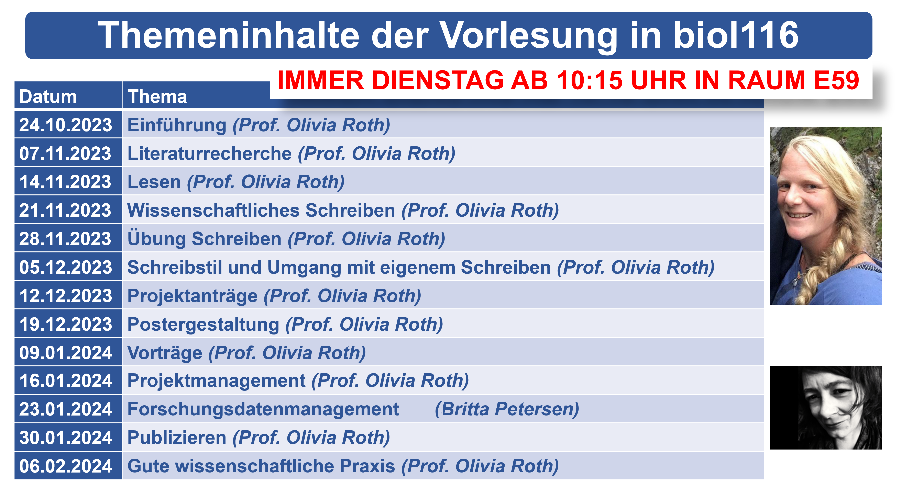
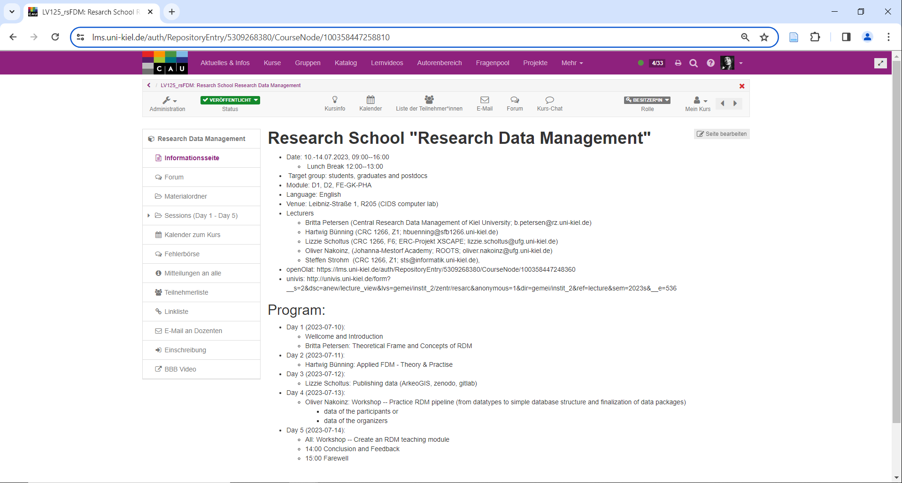
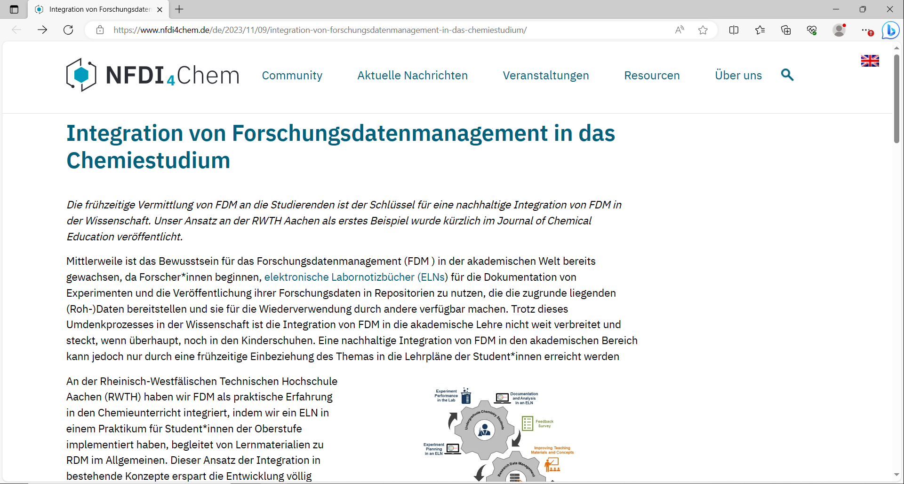
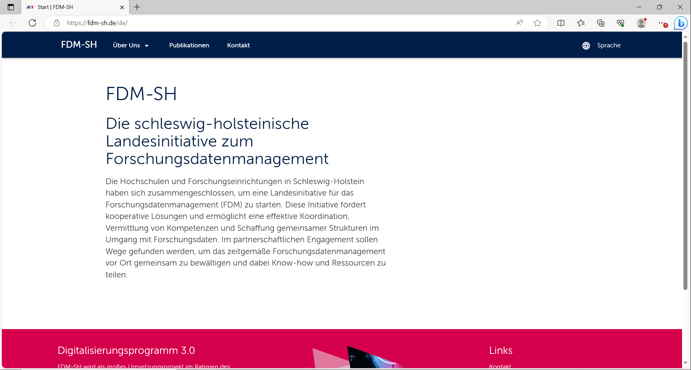

<!--

author:   Britta Petersen
email:    b.petersen@rz.uni-kiel.de
version:  0.1.0
language: de
narrator: German Female

icon:     images/Logo_cau-norm-de-lilagrey-rgb-0720_2022.png

comment:  This document provides a brief introduction to research data management for lecturers.
keywords: FDM, RDM, Forschungsdatenmanagement, Forschungsdaten, Hochschullehre, Datenkompetenzen, data literacy

-->

# Forschungsdatenmanagement in der Hochschullehre

(Illustration: Cleo Michelsen)

[Britta Petersen](mailto:b.petersen@rz.uni-kiel.de), [Zentrales Forschungsdatenmanagement](https://www.datamanagement.uni-kiel.de/de)

## Warm up

> **<big>Lassen Sie uns zum Aufwärmen ein kleines Spiel spielen:</big>**
>
> Verdecken Sie Ihre Kamera mit einem Post-it oder einem Finger.
>
> Ich lese Aussagen vor.
>
> Bei jeder Aussage, der Sie zustimmen können, zeigen Sie sich bitte wieder und winken kurz in die Kamera.
>
> That's it !

{{1-2}}
********************************************************************************

>
<big>Ich kenne die FAIR-Prinzipien.</big>

********************************************************************************

{{2-3}}
********************************************************************************

>
<big>Ich bin hauptsächlich in der Lehre tätig.</big>

********************************************************************************

{{3-4}}
********************************************************************************

>
<big>Ich habe schon mal von der NFDI e. V. gehört.</big>

********************************************************************************

{{4-5}}
********************************************************************************

>
<big>Ich arbeite in einem naturwissenschaftlichen Bereich.</big>

********************************************************************************

{{5-6}}
********************************************************************************

>
<big>Ich arbeite in einem geisteswissenschaftlichen Bereich.</big>

********************************************************************************

{{6-7}}
********************************************************************************

>
<big>Ich habe schon mal einen Datenmanagementplan geschrieben.</big>

********************************************************************************

{{7-8}}
********************************************************************************

>
<big>In meinen Lehrveranstaltungen werden bereits FDM-Aspekte behandelt.</big>

********************************************************************************

{{8-9}}
********************************************************************************

>
<big>Ich habe eine ORCID.</big>

********************************************************************************

{{9-10}}
********************************************************************************

>
<big>Ich nutze OER und/oder offene Daten in meinen Lehrveranstaltungen.</big>

********************************************************************************

{{10-11}}
********************************************************************************

>
<big>Ich bin Autor\*in einer (oder mehrerer) Datenpublikation(en).</big>

********************************************************************************

## Workshop Regeln

 <!-- width="250px" align="right" -->

- Machen Sie auf sich aufmerksam, wenn Sie etwas sagen wollen.
- Hören Sie sich gegenseitig zu und lassen Sie einander ausreden.
- Helfen Sie sich gegenseitig.
- Erledigen Sie möglichst nichts nebenbei.
- Beteiligen Sie sich aktiv.

## Ziele dieses Workshops

 <!-- width="200px" align="right" -->

Ich möchte mit Ihnen erreichen, dass Sie am Ende des Workshops ...

* ... beschreiben können, welche Themenaspekte zum Themenkomplex FDM gehören.  
* ... über Voraussetzungen, Ideen und Ansätze zur Integration von FDM-Aspekten in die Lehre reflektiert und diskutiert haben.
* ... ein bisschen Spaß hatten.

# Orientierung: Themenbereich FDM

## ~~Wordcloud~~: Forschungsdatenmanagement

 <!-- width="100px" align="right" -->

**Was genau ist nun mit dem Begriff Forschungsdatenmanagement gemeint?**

Welche Inhaltsaspekte gehören eigentlich dazu? Lassen Sie uns kurz gemeinsam sammeln!

> Was denken Sie? Welche Inhaltsaspekte gehören zum Themenspektrum FDM?
>
> Geben Sie unter https://answergarden.ch/2861448 Begriffe ein, die Sie mit dem Begriff Forschungsdatenmanagement verbinden. Sie dürfen so viele Eingaben machen, wie Sie möchten.

<iframe src="https://answergarden.ch/2861448" style="border:0px;width:100%;height:500px" allowfullscreen="true" webkitallowfullscreen="true" mozallowfullscreen="true"></iframe>

## Orientierungshilfe: Lernzielmatrix zum Themenbereich FDM

 <!-- width="150px" align="right" -->

**Diskussion:**
---
Überfliegen Sie die in der [**Lernzielmatrix zum Themenbereich FDM**](https://zenodo.org/record/7034478#.Y4X_3HbMJPY) aufgeführten Themenbereiche/Inhaltsaspekte

Überlegen Sie:

* Decken sich die aufgeführten Aspekte mit Ihren Vorstellungen?
* Sind Aspekte aufgeführt, die Sie nicht erwartet hätten?
* Fehlen Ihnen bestimmte Aspekte?
* Wenn Sie an Ihre eigene Lehre denken, gibt es Aspekte, die bereits vermittelt werden?
* Sehen Sie Anknüfungspunkte an Ihre fachlichen Inhalte?  

---

Notieren Sie gerne Stichpunkte zu Ihren Gedanken auf dem Miro-Board: https://miro.com/app/board/uXjVNOu-m6c=/?moveToWidget=3458764569982235932&cot=14.

---

### Mitwirkung erwünscht!

 <!-- width="150px" align="right" -->

><big>Community Event zur Lernzielmatrix zum Forschungsdatenmanagement</big>
>
>Januar 2024 - 01. Februar 2024, Darmstadt
>
>Gemeinsames Community Event zur Lernzielmatrix der [DALIA (Data Literacy Alliance)](https://dalia.education), [UAG Schulung/Fortbildung der DINI/nestor AG Forschungsdaten](https://www.forschungsdaten.org/index.php/UAG_Schulungen/Fortbildungen) und der [NFDI-Sektion Training & Education](https://www.forschungsdaten.org/index.php/UAG_Schulungen/Fortbildungen)
>
>Hier finden Sie weitere [**Informationen und Anmeldung**](https://dalia.education/#aktuelles)

Ihre Ideen, Anmerkungen, Erweiterungsvorschläge, Kritik dürfen Sie sehr gerne auch an Britta Petersen und/oder Linda Zollitsch weitergeben.  

## Begriffsdefinition Forschungsdatenmanagement

{{1}}
********************************************************************************
Das Portal **Forschungsdaten.info** definiert den Begriff **"Forschungsdatenmanagement"** folgendermaßen:

> Forschungsdatenmanagement (FDM) umfasst die Prozesse der **Transformation**, **Selektion** und **Speicherung** von Forschungsdaten mit dem gemeinsamen **Ziel**, diese *langfristig* und *personenunabhängig* **zugänglich**, **nachnutzbar** und **nachprüfbar** zu halten.
>
>(*[forschungsdaten.info](https://forschungsdaten.info/themen/informieren-und-planen/was-ist-forschungsdatenmanagement/), letzter Zugriff 15.11.2023*)

********************************************************************************

## Begriffsdefinition Forschungsdaten

**Und was sind Forschungsdaten?**

{{2}}
********************************************************************************
Die **DFG** definiert den Begriff **"Forschungsdaten"** folgendermaßen:

> „Zu Forschungsdaten zählen u. a. Messdaten, Laborwerte, audiovisuelle Informationen, Texte, Surveydaten oder Beobachtungsdaten, methodische Testverfahren sowie Fragebögen. Korpora und Simulationen können ebenfalls zentrale Ergebnisse wissenschaftlicher Forschung darstellen und werden daher ebenfalls unter den Begriff Forschungsdaten gefasst. Da Forschungsdaten in einigen Fachbereichen auf der Analyse von Objekten basieren (z. B. Gewebe-, Material-, Gesteins-, Wasser- und Bodenproben, Prüfkörper, Installationen, Artefakte und Kunstgegenstände), muss der Umgang mit diesen ebenso sorgfältig sein und eine fachlich adäquate Nachnutzungsmöglichkeit, wann immer sinnvoll und möglich, mitgedacht werden. Ähnliches gilt, wenn Software für die Entstehung oder Verarbeitung von Forschungsdaten erforderlich ist.“
>
> (*[DFG - Umgang mit Forschungsdaten](https://www.dfg.de/foerderung/grundlagen_rahmenbedingungen/forschungsdaten/), letzer Zugriff 15.11.2024*)

********************************************************************************

{{3}}
********************************************************************************

Etwas weniger kompliziert definierte das PrePARe Projekt der Camebridge University den Begriff **Forschungsdaten** als:

> “Any any information you use in your research.”
>
> (*University of Camebridge PrePARe Project*)

********************************************************************************

### Beispiele für Forschungsdaten

 <!-- width="350px" align="right" -->

- Audio- und Videoaufzeichnungen
- Tagebücher
- Daten aus geografischen Informationssystemen (GIS)
- Labor- und Feldnotizen
- Modell-, Skript- und Forschungssoftwarecode
- Bilder und Abbildungen
- Fragebögen und Codebücher
- Proben und Artefakte
- Sensor-Daten
- Sequenzierdaten
- Spektren
- Text- und Tabellenkalkulationsdokumente
- Textkorpora und Annotationen
- Topographie-Daten
- Abschriften

# ~~Diskussion~~: Argumente pro FDM / FDM im Studium

 <!-- width="150px" align="right" -->

**Wir schauen uns ein kurzes Video an. Behalten Sie dabei folgende Fragen im Hinterkopf:**

* **Allgemein**: Welchen Nutzen/welche Vorteile kann ein gutes Forschungsdatenmanagement haben?
* **Hochschullehre**: Warum sollte das Thema bereits im Rahmen des Studiums behandelt werden?

Ihre Gedanken dürfen Sie gerne auf dem Miro-Board festhalten: https://miro.com/app/board/uXjVNOu-m6c=/?moveToWidget=3458764569982235933&cot=14

---

{{1}}
********************************************************************************

Movie time!

---

<iframe width="560" height="315" src="https://www.youtube.com/embed/66oNv_DJuPc" title="YouTube video player" frameborder="0" allow="accelerometer; autoplay; clipboard-write; encrypted-media; gyroscope; picture-in-picture; web-share" allowfullscreen></iframe>

---

********************************************************************************

{{2}}
********************************************************************************
>**Gutes Forschungsdatenmanagement trägt bei zu ...**
>
> - Reproduzierbarkeit von Ergebnissen (GWP)
> - Rückverfolgbarkeit und Transparenz der Forschung (GWP)
> - gute Auffindbarkeit von Daten, z. B. durch aussagekräftige Benennung und beschreibende Metadaten
> - Wissenserhalt – Daten sollen unabhängig von einzelnen Menschen, Projekten oder Institutionen zugänglich sein (GWP)
> - Erleichterung der Zusammenarbeit
> - Vorbeugung von Datenverlusten
> - Kostenersparnis, z. B. durch Nachnutzung statt neuer Erhebung
> - Transfer der Daten in zukünftige Projekte
> - Erhöhung der Sichtbarkeit der eigenen Arbeit durch Forschungsdatenzitation
> - Erfüllung von Auflagen der Drittmittelgeber
> - ….

********************************************************************************

# FDM in der Lehre: erste Ansätze

**Beispiele erster Ansätze und Aktivitäten**

{{1-2}}
********************************************************************************
Kollaborative Entwicklung von Lehr-/Lernmaterialien in den Projekten [elBB4RDM](https://www.datamanagement.uni-kiel.de/de/aktivitaeten/projekte/Projekt%20eLBB4RDM) und [Modulare Bausteine für die digitale Lehre in den Geisteswissenschaften](https://www.datamanagement.uni-kiel.de/de/aktivitaeten/projekte/Projekt_DH-Bausteine), gefördert durch das CAU Programm für Digitalisierung in der Lehre 2021-2023

<iframe src="https://liascript.github.io/course/?https://raw.githubusercontent.com/BrittaP/LiaTestmodule_offen/main/Ordnung_und_Stuktur/2022_OrdnungStruktur_de.md#1" style="border:0px;width:100%;height:500px" allowfullscreen="true" webkitallowfullscreen="true" mozallowfullscreen="true"></iframe>

********************************************************************************

{{2-3}}
********************************************************************************
Integration in eine bestehende Vorlesung

********************************************************************************

{{3-4}}
********************************************************************************
Entwicklung einer eigenständigen Veranstaltung

********************************************************************************

{{4}}
********************************************************************************
Integration in ein bestehendes Praktikum

weitere Informationen: https://www.nfdi4chem.de/de/2023/11/09/integration-von-forschungsdatenmanagement-in-das-chemiestudium/

********************************************************************************

# Aktuelle Entwicklungen / wichtige Player

{{0-2}}
********************************************************************************

**Forschungsförderer** legen zunehmend Wert auf ein gutes Forschungsdatenmanagement und fordern bei Forschungsanträgen z. B. den Nachweis von Planungen (DMPs) zum Umgang mit Daten.

********************************************************************************

{{1-2}}
********************************************************************************

---

 <!-- width="100px" align="right" -->

**Deutsche Forschungsgemeinschaft (DFG)**:

Als größter Forschungsförderer in Deutschland hat sich die **DFG** mit dem Thema Forschungsdatenmanagement auseinandergesetzt. 2015 wurden die [DFG-Leitlinien zum Umgang mit Forschungsdaten](https://www.dfg.de/foerderung/grundlagen_rahmenbedingungen/forschungsdaten/) veröffentlicht und ist durch fachspezifische Empfehlungen ergänzt. Der neue [Kodex "Leitlinien zur Sicherung guter wissenschaftlicher Praxis"](https://wissenschaftliche-integritaet.de/kodex/) geht an vielen Stellen auf ***FAIR & Open Data*** ein.

---
 <!-- width="150px" align="right" -->

Das **Bundesministerium für Bildung und Forschung (BMBF)**:

Als einer der Förderer und Initiatoren der Nationalen Forschungsdateninfrastruktur verlangt das BMBF in den Richtlinien zur Förderung eine Datenmanagementplanung, wobei die Vorlagen hierzu variieren.

---

 <!-- width="150px" align="right" -->

**Europäische Kommission (EC):**

Im Rahmenprogramm Horizon 2020 wurden erstmals die Anforderungen an das Forschungsdatenmanagement im Open Data Pilot formuliert. Seit 2017 ist die Beteiligung am Open Data Pilot und somit das Datenmanagement nach den FAIR-Data-Prinzipien (findable, accessible, interoperable and reusable) mit einer mehrstufigen Datenmanagementplanung und der Veröffentlichung unter Open Access der Standard. Das gilt auch für das aktuelle [Rahmenprogramm Horizon Europe](https://ec.europa.eu/info/funding-tenders/opportunities/docs/2021-2027/horizon/guidance/programme-guide_horizon_en.pdf).

********************************************************************************

{{2-3}}
********************************************************************************

---

 <!-- width="150px" align="right" -->

**Nationale Forschungsdateninfrastruktur (NFDIs)**:

Finanziert durch Bund und Länder entsteht derzeit ein bundesweit verteiltes Kompetenz- und Infrastrukturnetzwerk, das die Bereitstellung und Erschließung von Forschungsdaten für die Wissenschaft sicherstellen soll.

[**NFDI e. V.**](https://www.nfdi.de/)

********************************************************************************

{{3-4}}
********************************************************************************

**Kurzer Rechercheauftrag**:

Welches Konsortium der NFDI ist für Ihren Fachbereich relevant?

[**NFDI e. V.**](https://www.nfdi.de/)

********************************************************************************

{{4}}
********************************************************************************

[**Landesinitiative FDM-SH**](https://fdm-sh.de/de/)

>**Gründung einer Interessengemeinschaft FDM-Lehre**
>
>Im Rahmen dieser neuen IG könnten unter anderem folgende Punkte gemeinsam erörtert/bearbeitet werden:
>
>* Austausch zu Lehr-Lern-Szenarien
>* gegenseitige Weiterbildung
>* gegenseitige Unterstützung und Beratung bei der Erstellung und Überarbeitung von Curricula
>* Sammlung von Best Practices und Materialien für Schulungen (für Studierende und Lehrende)
>
>Um uns in diesem Kontext das erste Mal zusammenzufinden und uns zu unseren Anliegen und Bedarfen auszutauschen, möchten wir euch zum Start der IG „FDM in der Lehre“ am **30. November 2023 von 10:00 bis 11:30 Uhr** in unseren virtuellen Raum (BigBlueButton) einladen.
>
>Der **Raum-Link** lautet: https://mediaportal01.rz.uni-kiel.de/b/slo-cwm-rz9-ym5.
>
>Wenn ihr über die Aktivitäten und Treffen dieser IG auf dem Laufenden bleiben möchtet, könnt ihr gerne die hierfür eingerichtete **Mailingliste** abonnieren: https://www.lists.uni-kiel.de/sympa/info/fdm-sh-lehre.

********************************************************************************

# Unsere (Lehre-)Angebote an der CAU

* regelmäßig stattfindende Workshops für PhDs am Graduiertenzentrum (Introduction to RDM)
* regelmäßig stattfindende Workshops für Lehrende an der Wissenschaftlichen Weiterbildung (Train-the-Lecturer Forschungsdatenmanagement)
* Workshops on demand, z. B. zugeschnitten für Arbeitsgruppen oder auf Tools (z. B. Git)
* Unterstützung und Mitwirkung in Lehr- und Infoveranstaltungen
* Unterstützung bei der Konzeption von Lehrveranstaltungen
* Lern-/Lernmaterialien

# Ihre Wünsche

>**Gemeinschaftsarbeit im Plenum**
>
>Tragen Sie bitte Themen- und/oder Unterstützungwünsche für zukünftige Workshops in das Miro-Board ein:
>
>https://miro.com/app/board/uXjVP0G7n2Y=/?moveToWidget=3458764543457520234&cot=14

# Herzlichen Dank!

 <!-- width="250px" align="right" -->

>Mehr zum FDM an der CAU finden Sie hier: https://www.fdm.uni-kiel.de/de
>
>Beratung und Unterstützung zur Integration von FDM-Aspekten in die Lehre bieten:
>
>[Britta Petersen](mailto:b.petersen@rz.uni-kiel.de) und [Linda Zollitsch](zollitsch@ub.uni-kiel.de)
>
>Bitte zögern Sie nicht, uns anzusprechen!

# Quellen

Positionspapier zu FAIR und Open Data im physikalischen Praktikum, ZaPF, 2020, online unter https://zapfev.de/resolutionen/wise20/opendata/opendata.pdf

Jaeger, Philipp, & Bode, Janice. (2021). Redet über die Daten! - Forschungsdatenmanagement und Hochschullehre in der Physik und darüber hinaus. Zenodo. https://doi.org/10.5281/zenodo.5168524

Klump, J., Wyborn, L., Downs, R., Asmi, A., Wu, M., Ryder, G., & Martin, J. (2020). Principles and best practices in data versioning for all data sets big and small. Version 1.1. Research Data Alliance. [DOI: 10.15497/RDA00042](https://doi.org/10.15497/RDA00042).

https://forschungsdaten.info/themen/beschreiben-und-dokumentieren/datendokumentation/

https://www.fdm.uni-hannover.de/fileadmin/fdm/Dokumente/Schulungsunterlagen/Schulungsunterlagen_FDM_VertiefungDatenorganisation_Folien.pdf

https://datamanagement.hms.harvard.edu/collect/file-naming-conventions

https://mantra.ed.ac.uk/

https://learn.opengeoedu.de/

https://ddi-lifecycle-3-2-documentation.readthedocs.io/en/latest/generalstructures/versioning.html

https://www.forschungsdaten-bildung.de/dateien-benennen#DateiorganisationOrdnerstruktur

https://mantra.ed.ac.uk/

https://www.dfg.de/download/pdf/foerderung/grundlagen_dfg_foerderung/forschungsdaten/forschungsdaten_checkliste_de.pdf
