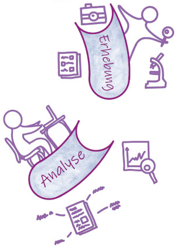
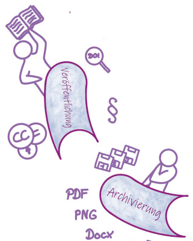

<!--

author:   Britta Petersen
email:    b.petersen@rz.uni-kiel.de
version:  0.1.0
language: de
narrator: DE German Female

icon:     images/Logo_cau-norm-de-lilagrey-rgb-0720_2022.png

comment:  This document provides a brief introduction into the fair data pronciples.

-->

# infBsemDHI-01a - Disclaimer

>**Britta Petersen, Cleo Michelsen**
>
>Central Research Data Management of Kiel University
>
>**Disclaimer**: Please note that you are leaving the CAU pages once you open this presentation in your browser. This presentation includes links to other third party websites and services. When you click on these links you will leave this presentation and will be redirected to the respective another sites. These sites are not under our control.
>
>RDM@CAU is not responsible for the content of linked third party websites. Please be aware that the security and privacy policies on these sites may be different than CAU policies, so please read third party privacy and security policies closely.
>
> To see this document as an interactive LiaScript rendered version, click on the
> following link/badge:
>
> 
>
> If you need help, feel free to ask us any questions:
>
> [b.petersen@rz.uni-kiel.de](mailto:b.petersen@rz.uni-kiel.de)
>
> ____________________________________________
>
>  This work is licensed under a [Creative Commons Attribution 4.0 International License](https://creativecommons.org/) with exception of the used material from other copyright holders.

# Forschungsdatenmanagement

**Besuch aus dem Zentralen Forschungsdatenmanagment der CAU**

  
    Illustration: Cleo Michelsen

# Forschungsdaten?

{{0-1}}
********************************************************************************

> <!-- style="width: 20%; float:right" -->
>
>**Lassen Sie uns kurz gemeinsam sammeln!**
>
>* Welche Beispiele für Forschungsdaten können Sie nennen?
>
>https://answergarden.ch/4024842
>
> Sie dürfen so viele Begriffe eingeben, wie Sie möchten.

---

********************************************************************************

{{1-2}}
********************************************************************************

<iframe src="https://answergarden.ch/4024842" style="border:0px;width:100%;height:500px" allowfullscreen="true" webkitallowfullscreen="true" mozallowfullscreen="true"></iframe>

********************************************************************************

{{2-3}}
********************************************************************************
Die DFG schreibt hierzu:

> „Zu Forschungsdaten zählen u. a. Messdaten, Laborwerte, audiovisuelle Informationen, Texte, Surveydaten oder Beobachtungsdaten, methodische Testverfahren sowie Fragebögen. Korpora und Simulationen können ebenfalls zentrale Ergebnisse wissenschaftlicher Forschung darstellen und werden daher ebenfalls unter den Begriff Forschungsdaten gefasst. Da Forschungsdaten in einigen Fachbereichen auf der Analyse von Objekten basieren (z. B. Gewebe-, Material-, Gesteins-, Wasser- und Bodenproben, Prüfkörper, Installationen, Artefakte und Kunstgegenstände), muss der Umgang mit diesen ebenso sorgfältig sein und eine fachlich adäquate Nachnutzungsmöglichkeit, wann immer sinnvoll und möglich, mitgedacht werden. Ähnliches gilt, wenn Software für die Entstehung oder Verarbeitung von Forschungsdaten erforderlich ist.“
>
> (**DFG 2021**)

********************************************************************************

{{3-4}}
********************************************************************************

Etwas weniger kompliziert definierte das PrePARe Projekt der Camebridge University den Begriff Forschungsadaten:

> “Any any information you use in your research.”
>
> (**University of Camebridge PrePARe Project**)

********************************************************************************

{{4}}
********************************************************************************

 <!-- width="350px" align="right" -->

**Beispiele für Forschungsdaten**:

- Audio- und Videoaufzeichnungen
- Tagebücher
- Daten aus geografischen Informationssystemen (GIS)
- Labor- und Feldnotizen
- Modell-, Skript- und Forschungssoftwarecode
- Bilder und Abbildungen
- Fragebögen und Codebücher
- Proben und Artefakte
- Sensor-Daten
- Sequenzierdaten
- Spektren
- Text- und Tabellenkalkulationsdokumente
- Textkorpora und Annotationen
- Topographie-Daten
- Abschriften

********************************************************************************

# Forschungsdatenmanagement?

> Forschungsdatenmanagement (FDM) umfasst die Prozesse der **Transformation**, **Selektion** und **Speicherung** von Forschungsdaten mit dem gemeinsamen **Ziel**, diese *langfristig* und *personenunabhängig* **zugänglich**, **nachnutzbar** und **nachprüfbar** zu halten.
>
>(**forschungsdaten.info**)

# Ziel: FAIRe Daten

**Ziel**: Daten langfristig und personenunabhängig [auffindbar], zugänglich, nachnutzbar und nachprüfbar halten.

***--> Den Original Artikel finden Sie [hier](https://www.nature.com/articles/sdata201618).***

{{0-1}}
********************************************************************************

.") <!-- width="500px" -->

********************************************************************************

{{1-2}}
********************************************************************************

********************************************************************************

{{2}}
>**F**indable

{{3-4}}
****************
Der erste Schritt bei der (Wieder-)Verwendung von Daten besteht darin, sie zu finden. Metadaten und Daten sollten sowohl für Menschen als auch für Computer leicht zu finden sein. Maschinenlesbare Metadaten sind für das automatische Auffinden von Datensätzen und Diensten unerlässlich und daher ein wesentlicher Bestandteil des FAIRification-Prozesses.

F1. (Meta)data are assigned a globally unique and persistent identifier

F2. Data are described with rich metadata (defined by R1 below)

F3. Metadata clearly and explicitly include the identifier of the data they describe

F4. (Meta)data are registered or indexed in a searchable resource

***************

{{4}}
>**A**ccessible

{{5-6}}
***********************
Sobald der Nutzer die gewünschten Daten gefunden hat, muss er wissen, wie er auf sie zugreifen kann, möglicherweise einschließlich Authentifizierung und Autorisierung.

A1. (Meta)data are retrievable by their identifier using a standardised communications protocol

A1.1 The protocol is open, free, and universally implementable

A1.2 The protocol allows for an authentication and authorisation procedure, where necessary

A2. Metadata are accessible, even when the data are no longer available

******************

{{6}}
>**I**nteroperable

{{7-8}}
**********************
Daten sollten in einer Form vorliegen, die die Nutzung mit diversen Anwendungen oder Arbeitsabläufen für die Analyse, Speicherung und Verarbeitung ermöglichen.

I1. (Meta)data use a formal, accessible, shared, and broadly applicable language for knowledge representation.

I2. (Meta)data use vocabularies that follow FAIR principles

I3. (Meta)data include qualified references to other (meta)data

**********************

{{8}}
>**R**eusable

{{9}}
***************
Das Ziel von FAIR ist es, die Wiederverwendung von Daten zu optimieren. Um dies zu erreichen, sollten Metadaten und Daten gut dokumentiert und beschrieben sowie mit einer eindeutigen Angabe bzgl. der Nutzungsbedingungen (Lizenzen) versehen sein.

R1. Meta(data) are richly described with a plurality of accurate and relevant attributes

R1.1. (Meta)data are released with a clear and accessible data usage license

R1.2. (Meta)data are associated with detailed provenance

R1.3. (Meta)data meet domain-relevant community standards

**************

# Forschungsdatenlebenszyklus

Prozesse der Transformation, Selektion und Speicherung von Forschungsdaten entlang des Forschungsdatenlebenszyklus...

{{0-1}}
************

 <!-- width="500px" -->

************

{{1-2}}
********************************************************************************
 <!-- width="150px" align="right" -->

**Planung**:

* Werden Daten wiederverwendet?
* Brauche ich eine Erlaubnis, um die Daten nachzunutzen oder zu erheben?
* Wem gehören die Daten, die ich erhebe?
* Welche Erhebungsmethode ist angemessen?
* Welche Datendokumentation ist angemessen und notwendig?
* Welches Datenvolumen ist zu erwarten?
* Welche Datentypen, im Sinne von Datenformaten (z. B. Bilddaten, Textdaten oder Messdaten in Tabellen) entstehen?
* Wie sieht eine sichere Datenaufbewahrung aus?
* Wer hat Zugang zu meinen Daten?
* Wer ist verantwortlich?
* Welche Rechte habe ich, um die Daten zu publizieren?

---

********************************************************************************

{{2-3}}
********************************************************************************
 <!-- width="150px" align="right" -->

**Erhebung und Analyse**:

* Welche Ansätze werden verfolgt, um die Daten kontinuierlich nachvollziehbar zu dokumentieren?
* Welche Maßnahmen werden getroffen, um eine hohe Qualität der Daten zu gewährleisten?
* Welche digitalen Methoden und Werkzeuge (z. B. Software) sind zur Nutzung und Analyse der Daten erforderlich?
* Auf welche Weise werden die Daten während der Projektlaufzeit gespeichert und gesichert?
* Wie wird die Sicherheit sensibler Daten während der Projektlaufzeit gewährleistet (Zugriffs- und Nutzungsverwaltung)?

********************************************************************************
---

{{3-4}}
********************************************************************************

 <!-- width="150px" align="right" -->

**Archivierung & Veröffentlichung**:

* Welche rechtlichen Besonderheiten bestehen im Zusammenhang mit dem Umgang mit Forschungsdaten in dem Forschungsprojekt?
* Sind Auswirkungen oder Einschränkungen in Bezug auf die spätere Veröffentlichung bzw. Zugänglichkeit zu erwarten?
* Auf welche Weise werden nutzungs- und urheberrechtliche Aspekte sowie Eigentumsfragen berücksichtigt?
* Existieren wichtige wissenschaftliche Kodizes bzw. fachliche Normen, die Berücksichtigung finden sollten?

---
********************************************************************************

{{4-5}}
********************************************************************************

 <!-- width="150px" align="right" -->

**Nachnutzung**:

* Welche Daten bieten sich für eine Nachnutzung besonders an?
* Nach welchen Kriterien werden Forschungsdaten ausgewählt, um diese für die Nachnutzung durch andere zur Verfügung zu stellen?
* Planen Sie die Archivierung Ihrer Daten in einer geeigneten Infrastruktur?

  * Falls ja, wie und wo? Gibt es Sperrfristen?

* Wann und unter welchen Bedingungen sind die Forschungsdaten für Dritte nutzbar?

********************************************************************************

# Nutzen von FAIR data?

> <!-- width="150px" align="right" -->
>
>**Tauschen Sie sich kurz mit einer benachbarten Person aus.**
>
>* Welchen Nutzen kann die Beachtung der FAIR-Prinzipien und das gut strukturierte Datenmanagement für die eigene Forschung wie für die Wissenschaft insgesamt haben?

{{1-2}}
********************************************************************************
>**Die Beachtung der FAIR Prinzipien trägt bei zu...**
>
> - Reproduzierbarkeit von Ergebnissen (GWP)
> - Rückverfolgbarkeit und Transparenz der Forschung (GWP)
> - gute Auffindbarkeit von Daten, z. B. durch aussagekräftige Benennung und beschreibende Metadaten
> - Wissenserhalt – Daten sollen unabhängig von einzelnen Menschen, Projekten oder Institutionen zugänglich sein (GWP)
> - Erleichterung der Zusammenarbeit
> - Vorbeugung von Datenverlusten
> - Kostenersparnis, z. B. durch Nachnutzung statt neuer Erhebung
> - Transfer der Daten in zukünftige Projekte
> - Erhöhung der Sichtbarkeit der eigenen Arbeit durch Forschungsdatenzitation
> - Erfüllung von Auflagen der Drittmittelgeber
> - ….

********************************************************************************

## Wie FAIR sind Ihre Daten?

> <!-- width="150px" align="right" -->
>
>**Tauschen Sie sich gerne nochmal kurz mit einer benachbarten Person aus.**
>
>* Wenn Sie an die im Rahmen dieses Seminars erarbeiteten Daten denken, welche Aspekte der FAIR-Prinzipien haben Sie bereits mitgedacht?
>
>* Welche Aspekte haben Sie noch nicht mitgedacht? Wo sehen Sie Verbesserungsmöglichkeiten?
>
>* Zu welchen Aspekten bräuchten Sie Unterstützung bzw. welche Aspekte können Sie vielleicht alleine nicht klären?

---

<iframe src="https://www.oncoo.de/t/z7f7" style="border:0px;width:100%;height:500px" allowfullscreen="true" webkitallowfullscreen="true" mozallowfullscreen="true"></iframe>

# Berufliche Perspektiven

> Mit wissenschaftlicher Expertise ***und*** guten Kenntnissen im Bereich des Datenmanagements entstehen zusätzliche berufliche Perspektiven innerhalb Fachwissenschaften sowie in zentralen Einrichtungen, wie etwa Rechenzentren, Universitätsbibliotheken, Landesinitiativen und Konsortien der NFDI.
>
> Mögliche Berufsbezeichnungen für diese Tätigkeitsbereiche sind z. B.:
>
> * Data Steward,
> * Data Curator und/oder
> * Data Collector
>
> Hierfür sind gute Kenntnisse und Fähigkeiten im Umgang mit digitalen Daten erforderlich, die über rein fachliche Fragestellungen hinaus gehen. Momentan fehlt in den meisten Fachbereichen eine formale Ausbildung in diesem Bereich.
>
>Ein Beispiel für eine entsprechende Stellenausschreibung finden Sie hier: https://recruitingapp-5636.de.umantis.com/Vacancies/418/Description/31

# Herzlichen Dank!

 <!-- width="250px" align="right" -->

Mehr zum FDM an der CAU finden Sie hier:

https://www.fdm.uni-kiel.de/de

