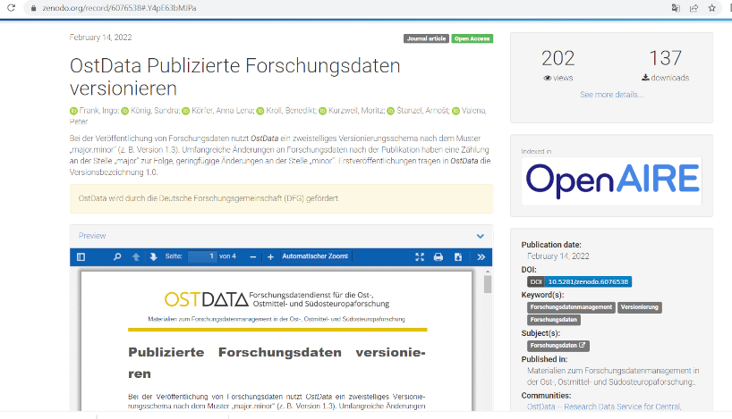
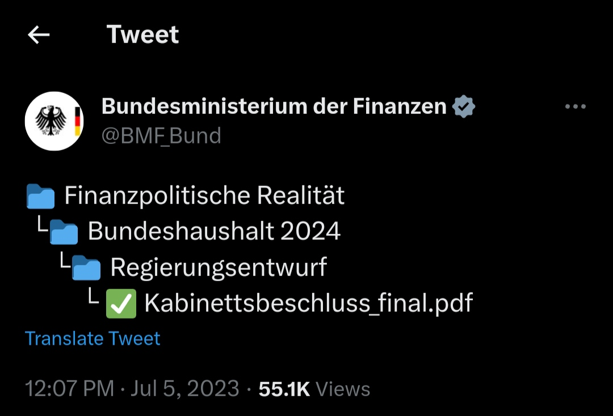

<!--

author:   Britta Petersen
email:    b.petersen@rz.uni-kiel.de
version:  0.2.0
language: de
narrator: DE German Female

icon:     images/Logo_cau-norm-de-lilagrey-rgb-0720_2022.png

comment:  Einführung ins Thema Forschungsdatenmanagement im Rahmen der [Veranstaltung biol116 - Kommunikation in der Wissenschaft](https://univis.uni-kiel.de/formbot/dsc_3Danew_2Ftlecture_26tdir_3Dmathe_2Fbiolog_2Fbachel_5F10_2Fgrunds_1_2Fbiol11_26lang_3Den_26ref_3Dtlecture)

-->


# Forschungsdatenmanagement

>**Britta Petersen**
>
>[Central Research Data Management of Kiel University](https://www.fdm.uni-kiel.de/de)

<div style="center; width:55%;">
  
    <sub style="text-align: center;">Illustration: Cleo Michelsen</sub>
</div>

<div style="page-break-after: always;"></div>


# Disclaimer

>TinyURL zu dieser Präsentation: 

>**Disclaimer**: Please note that you are leaving the CAU pages once you open this presentation in your browser. This presentation includes links to other third party websites and services. When you click on these links you will leave this presentation and will be redirected to the respective another sites. These sites are not under our control.
>
>RDM@CAU is not responsible for the content of linked third party websites. Please be aware that the security and privacy policies on these sites may be different than CAU policies, so please read third party privacy and security policies closely.
>
> To see this document as an interactive LiaScript rendered version, click on the
> following link/badge:
>
> [](https://liascript.github.io/course/?https://raw.githubusercontent.com/BrittaP/eLBB4RDM/refs/heads/main/2025_FDM_Biol-116.md)
>
> If you need help, feel free to ask us any questions:
>
> [b.petersen@rz.uni-kiel.de](mailto:b.petersen@rz.uni-kiel.de)
>
> ____________________________________________
>
>  This work is licensed under a [Creative Commons Attribution 4.0 International License](https://creativecommons.org/) with exception of the used material from other copyright holders.

<div style="page-break-after: always;"></div>

# Forschungsdaten...? 🧪

{{0-1}}
********************************************************************************

> <!-- style="width: 20%; float:right" -->
>
>**Lassen Sie uns kurz gemeinsam sammeln!**
>
>* Welche Beispiele für Forschungsdaten können Sie nennen?
>
>https://answergarden.ch/4024842
>
> Sie dürfen so viele Begriffe eingeben, wie Sie möchten.

---

********************************************************************************

{{1-2}}
********************************************************************************

<iframe src="https://answergarden.ch/4024842" style="border:0px;width:100%;height:500px" allowfullscreen="true" webkitallowfullscreen="true" mozallowfullscreen="true"></iframe>

<div style="page-break-after: always;"></div>

********************************************************************************

{{2-3}}
********************************************************************************
Die DFG schreibt hierzu:

> „Zu Forschungsdaten zählen u. a. Messdaten, Laborwerte, audiovisuelle Informationen, Texte, Surveydaten oder Beobachtungsdaten, methodische Testverfahren sowie Fragebögen. Korpora und Simulationen können ebenfalls zentrale Ergebnisse wissenschaftlicher Forschung darstellen und werden daher ebenfalls unter den Begriff Forschungsdaten gefasst. Da Forschungsdaten in einigen Fachbereichen auf der Analyse von Objekten basieren (z. B. Gewebe-, Material-, Gesteins-, Wasser- und Bodenproben, Prüfkörper, Installationen, Artefakte und Kunstgegenstände), muss der Umgang mit diesen ebenso sorgfältig sein und eine fachlich adäquate Nachnutzungsmöglichkeit, wann immer sinnvoll und möglich, mitgedacht werden. Ähnliches gilt, wenn Software für die Entstehung oder Verarbeitung von Forschungsdaten erforderlich ist.“
>
> (**DFG 2021**)

********************************************************************************

{{3-4}}
********************************************************************************

Etwas weniger kompliziert definierte das PrePARe Projekt der Camebridge University den Begriff Forschungsadaten:

> “Any any information you use in your research.”
>
> (**University of Camebridge PrePARe Project**)

********************************************************************************

{{4}}
********************************************************************************

 <!-- width="350px" align="right" -->

**Beispiele für Forschungsdaten**:

- Audio- und Videoaufzeichnungen
- Tagebücher
- Daten aus geografischen Informationssystemen (GIS)
- Labor- und Feldnotizen
- Modell-, Skript- und Forschungssoftwarecode
- Bilder und Abbildungen
- Fragebögen und Codebücher
- Proben und Artefakte
- Sensor-Daten
- Sequenzierdaten
- Spektren
- Text- und Tabellenkalkulationsdokumente
- Textkorpora und Annotationen
- Topographie-Daten
- Abschriften

********************************************************************************

<div style="page-break-after: always;"></div>

# Forschungsdatenmanagement...? 🗃

{{0}}
********************************************************************************
 <!--
style="width: 20%; float:right"
title="Zusammenarbeit"
onclick="alert('Let´s work together!');"
-->


********************************************************************************

{{1-3}}
********************************************************************************
<!-- style="max-width: 80%; float:left" -->
> Forschungsdatenmanagement (FDM) umfasst alle Prozesse der **Transformation**, **Selektion** und **Speicherung** von Forschungsdaten mit dem gemeinsamen **Ziel**, diese *langfristig* und *personenunabhängig* **zugänglich**, **nachnutzbar** und **nachprüfbar** zu halten.
>
>-- www.forschungsdaten.info


********************************************************************************
{{2-3}}
********************************************************************************
<!-- style="max-width: 80%; float:left" -->
>Forschungsdatenmanagement umfasst alle Maßnahmen und Prozesse, die notwendig sind, um sicherzustellen, dass Forschungsdaten während des gesamten Forschungsdatenlebenszyklus – von der Planung und Erhebung über die Analyse bis hin zur Archivierung und Langzeitbewahrung – effizient und nachhaltig gehandhabt werden.
>
> -- OpenAI. (2025). ChatGPT (Version 4)

********************************************************************************

{{3}}
********************************************************************************

Zentrale Aspekte des FDM
---

- **Datenorganisation**

  - Strukturierung und Dokumentation der Daten, mit dem Ziel Auffindbarkeit und Nachvollziehbarkeit zu gewährleisten.

- **Datenqualität und -integrität**

  - Sicherstellung, dass die Daten korrekt, vollständig und zuverlässig sind.

- **Datensicherung**

  - Schutz vor Datenverlust, z. B. durch regelmäßige Backups und andere Sicherheitsmaßnahmen.

- **Datenarchivierung**

  - Langfristige Speicherung und Zugänglichmachung von Daten.

- **Datenzugang und -verfügbarkeit**

  - Sicherstellung, dass Daten für andere Forscher zugänglich sind, unter Berücksichtigung ethischer und rechtlicher Aspekte.

- **Datenethik und -recht**

  - Einhaltung gesetzlicher Bestimmungen, Datenschutzvorgaben und ethischer Richtlinien beim Umgang mit Forschungsdaten.

********************************************************************************

<div style="page-break-after: always;"></div>

# Leitprinzipien: FAIR 🧚

{{0-1}}
********************************************************************************

>Die **FAIR-Prinzipien** dienen als Leitprinzipien und Orientierungshilfe zur Erreichung des Ziels: ***Daten langfristig und personenunabhängig zugänglich, nachnutzbar und nachprüfbar zu halten.***

<!-- style="max-width: 90%; float:right" -->
.") 

********************************************************************************

{{1-2}}
********************************************************************************
<!-- style="font-size: 30px;" -->
>**F - ❓**
<!-- style="font-size: 30px;" -->
>**A - ❓**
<!-- style="font-size: 30px;" -->
>**I - ❓**
<!-- style="font-size: 30px;" -->
>**R - ❓**

********************************************************************************

{{2}}
<!-- style="font-size: 30px;" -->
>**F**indable

{{3-4}}
****************
Daten sollen so strukturiert und beschrieben werden, dass sie leicht auffindbar sind. Dazu gehört die Verwendung eindeutiger, stabiler Identifier (z. B. DOI) und eine klare, vollständige Dokumentation (Metadaten).

Metadaten und Daten sollten sowohl für Menschen als auch für Computer leicht zu finden sein. Maschinenlesbare Metadaten sind für das automatische Auffinden von Datensätzen und Diensten unerlässlich und daher ein wesentlicher Bestandteil FAIRer Daten.

***************

{{4}}
<!-- style="font-size: 30px;" -->
>**A**ccessible

{{5-6}}
***********************
Daten sollen unter klar definierten Bedingungen zugänglich sein. Sie sollten so gespeichert werden, dass sie auch langfristig, unabhängig von einer ursprünglichen Forschungsgruppe oder eines/einer einzelnen Forschenden, abgerufen werden können.

******************

{{6}}
<!-- style="font-size: 30px;" -->
>**I**nteroperable

{{7-8}}
**********************
Daten sollen in einer Form vorliegen, das es ermöglicht, sie mit anderen Datensätzen oder Softwaretools zu kombinieren, zu speichern und auszuwerten. Dies erfordert die Verwendung von offenen Standards und Formaten, die eine einfache Nutzung und Weiterverarbeitung ermöglichen.

**********************

{{8}}
<!-- style="font-size: 30px;" -->
>**R**eusable

{{9-10}}
***************
Das Ziel von FAIR ist es, die Wiederverwendung von Daten zu optimieren. Um dies zu erreichen, sollen Daten so aufbereitet werden, dass sie von anderen Forschenden für neue Forschungsfragen genutzt werden können. Dies bedeutet, dass sie gut dokumentiert sind, Lizenzhinweise beinhalten und die nötigen Informationen bereitstellen, um die Daten korrekt interpretieren zu können.

**************

{{10}}
***************
>***--> Das Original finden Sie hier: [The FAIR Guiding Principles for scientific data management and stewardship](https://www.nature.com/articles/sdata201618).***

***************

<div style="page-break-after: always;"></div>

# FDM & GWP

> <!-- width="150px" align="right" -->
>
>**Tauschen Sie sich kurz mit einer benachbarten Person aus.**
>
>* Welchen Nutzen kann ein gut strukturiertes Datenmanagement für die eigene Forschung wie für die Wissenschaft insgesamt haben?
>* Gutes Forschungsdatenmanagement gilt als ein Teil **~~guter wissenschaftlicher Praxis~~ (GWP)**. Inwiefern kann FDM zu GWP beitragen?

{{1-2}}
********************************************************************************
>**Gutes Forschungsdatenmanagement trägt bei zu...**
>
> - Reproduzierbarkeit von Ergebnissen (GWP)
> - Rückverfolgbarkeit und Transparenz der Forschung (GWP)
> - gute Auffindbarkeit von Daten, z. B. durch aussagekräftige Benennung und beschreibende Metadaten
> - Wissenserhalt – Daten sollen unabhängig von einzelnen Menschen, Projekten oder Institutionen zugänglich sein (GWP)
> - Erleichterung der Zusammenarbeit
> - Vorbeugung von Datenverlusten
> - Kostenersparnis, z. B. durch Nachnutzung statt neuer Erhebung
> - Transfer der Daten in zukünftige Projekte
> - Erhöhung der Sichtbarkeit der eigenen Arbeit durch Forschungsdatenzitation
> - Erfüllung von Auflagen der Drittmittelgeber
> - ….

********************************************************************************

<div style="page-break-after: always;"></div>

# Erste Schritte im FDM

<div style="text-align:center">
><p style="color:#9a047f">**Es mag banal erscheinen, aber eine strukturierte Ordner- und Dateibenennung ist ein erster Schritt im Forschungsdatenmanagement!**</p>
</div>

<center></center>

<div style="text-align:center">
<P><SMALL>https://xkcd.com/1459. Shared under CC-BY-NC License</SMALL></P>
</div>

<div style="page-break-after: always;"></div>

### Daten strukturiert ablegen

- Versuchen Sie, aussagekräftige Namen zu finden ➞ keine "Fantasienamen"

- Verwenden Sie ein einheitliches Schema und eine logische Struktur

  - Ordnerstruktur und Dateinamen

  - Hierarchische Ordnung mit dem Wichtigsten zuerst

  - Denken Sie an Ihre Vorlieben beim ___Sortieren!___

  - Berühren Sie niemals Ihre Rohdaten - bewahren Sie sie in einem separaten Ordner auf!

- Befolgen Sie [***ISO 8601***] (https://en.wikipedia.org/wiki/ISO_8601) für Daten und Zeiten

  - Datum und Uhrzeit, z.B. JJJJMMTThhmmss±hhmm

  - Datum, z. B. JJJJ-MM-TT

- Versionen? Verwenden Sie das [***semantische Versionsschema***](https://semverdoc.org/) (Major.Minor.Patch), z. B. 2.0.0

  - Vermeiden Sie Anhänge, wie \_final, \_fertig, \_inArbeit u. ä.

- Vermeiden Sie Leerzeichen und Sonderzeichen "🦄". 

- Erlaubte Sonderzeichen sind Unterstrich (_) und Bindestrich (-)

- ***Dokumentieren*** Sie Ihre Namenskonventionen und die verwendeten Abkürzungen

  - README.md

<div style="page-break-after: always;"></div>

### Beispiele

{{0-1}}
********************************************************************************

**Beispiel Ordnerstruktur**

<center>
  
    <sub style="text-align: right;">Provided by Oliver Nakoinz</sub>
</center>

********************************************************************************

{{1-2}}
****************************************

>**Beispiel für einen Dateinamen, der einer Benennungskonvention folgt:**
>
>[Project name]\_[Approach]\_[Location]\_[Person-ID]_[Date].[Format-Suffix]
>
>Rebel-Hunting\_Interview\_DS-1-Orbital-Battle-Station\_Organa\_1976-05-25.mp4

****************************************

<div style="page-break-after: always;"></div>

### Versionskontrolle

{{0-1}}
********************************************************************************

<center></center>

********************************************************************************

{{1-2}}
********************************************************************************

- Versionen in separaten Dateien speichern

  - Semantische Versionierung (Major.Minor.Patch), z.B.,

    - __0.1.0__ (eine Beta-Version)

    - __1.0.0__ (eine Release-Version)

    - __1.0.1__ (ein Release mit leichten Korrekturen)

  - kann im Dateinamen enthalten sein

  - Definieren Sie, was Sie als "Release" oder "leichte Korrektur" betrachten

- Dokumentieren Sie Ihr Versionsschema und dokumentieren Sie ständig Ihre Änderungen

  - README.md

  - Versionskontrolltabelle

- Arbeiten Sie in einem Team? Viele Änderungen? Verwenden Sie ein verteiltes Versionskontrollsystem!

  - Git

  - GitLab, GitHub
---

********************************************************************************

<div style="page-break-after: always;"></div>

{{2-3}}
********************************************************************************

**Wie eine Versionskontrolltabelle aussehen könnte**

| Versionsnr.  | Changes                      | Date      | changed by |
| :----------  | :----------                      | ---        | ---               |
| 1.0          | Release                         | 2016-11-2  | KL                |
| 1.1          | Erased spelling mistakes  | 2016-11-20 | KL                |
| 1.2          | Changed layout            | 2017-02-20 | GN                |
| 2.0          | Add new chapter (3.1.) | 2017-02-20 | GN                |

********************************************************************************

<div style="page-break-after: always;"></div>

{{3-4}}
********************************************************************************

**Beispiel für ein dokumentiertes Versionierungsschema**



Have a look here: [Zenodo](https://zenodo.org/record/6076538#.Y4pE63bMJPa)

********************************************************************************

<div style="page-break-after: always;"></div>


### Beispiel README

>Ordnerstrukturen und Namenskonventionen sollten in einer **README-Datei** dokumentiert werden, die als einfache Textdatei in der ersten hierarchischen Ebene der gewählten Ordnerstruktur abgelegt werden sollte. 

{{1}}
********************************************************************************

Eine README-Datei könnte so aussehen:

```markdown
**~~GENERAL~~**
This README reffers to all files related to

Project: Study project for the course Research Data Management in Prehistoric Archaeology

Description: [Short description of the project]

Course: Research Data Management in Prehistoric Archaeology

Lecturer(s): [Names]

last updated: 2023-07-10

**~~FOLDER~~**

All files related to the project live in the folder ***AnyStudyProject***, with content organized into subfolders as follows:

– ***RawData***: All raw data goes into this folder, subfolders organized by date if applicable

– ***AnalysedData***: Data files to be analysed, subfolders organized by date if applicable

– ***Figures***: Figures created from analysis files

– ***StudyThesisDrafts***: Draft of study thesis, including text, figures, outlines

– ***References***: Library of my references

– ***AnalogDocumentation***: Scanned copies of my written research notes and other research notes

– ***Miscellaneous***: Other information that relates to this project

**~~FILE NAMING~~**

Raw data files will be named as follows:

“raw_YYYYMMDD\_area\_object\_condition”
(example: “raw_20230701\_Bov\_bs\_2.csv”)

Analysis data files will be named as follows:

“YYYYMMDD\_area\_object\_condition_version”
(example: “20230701\_Bov\_bs\_2_v1-1.csv”)

**Abbreviations** in use:

*area*: KI=Kiel, Bov=Bovenau, Emk=Emkendorf

*objects*: bs=blade scraper, B=hatchet

*condition*: 1=fully preserved, 2=partly preserved, 3=poorly preserved/fragment

**~~VERSIONING~~**

Version information is given in the form of a major-minor specification in the file name (vmajor-minor).

**major changes**: Extensive corrections, adjustments or additions to a data set or text file, such as a large number of additional entries in a table or extensive cleaning of data or addition of a chapter to a text. In this case, the version number increases in steps of one ("major" number + 1), e.g. from version 2.0 to version 3.0. If the "major" version number is changed, the "minor" version number must be numbered upwards again starting from "0" (e.g. version change from 2.14 to 3.0).

**minor changes**: The version number in second place ("minor") increases by +1 if minor corrections have been made, such as the correction of spelling and typing errors in texts or tables.

**~~STORAGE~~**

All files will be stored on my computer and backed up [daily,weekly,...] to CAU Cloud and and an external hard disk.
```

********************************************************************************

## Weiter lernen

https://tinyurl.com/dateibenennung


<div style="page-break-after: always;"></div>

### How do we like this?



## Literaturverwaltung

Eine **Literaturverwaltungssoftware** hilft Ihnen, die für Ihre Arbeiten genutzten Quellen zu verwalten!

{{1-2}}
***
Das Rechenzentrum stellt Ihnen eine Citavi-Campuslizenz zur Verfügung:


https://www.rz.uni-kiel.de/de/angebote/software/citavi/citavi

***

<div style="page-break-after: always;"></div>

{{2}}
***
An der Universitätsbibliothek finden Sie Kurse zu citavi sowie verschiedenes Selbstlernmaterial:


https://www.ub.uni-kiel.de/de/beratung-kurse/Kurse/c3-12.html

***

<div style="page-break-after: always;"></div>

## opendata@uni-kiel.de

Für die Publikation von Daten, für die es keinen fachspezifischen Speicherort gibt, kann das Open-Data-Portal der CAU genutzt werden.

Sie schreiben bald eine Bachelorarbeit.

Denken Sie jetzt schon daran, wie Sie Ihre Daten nachhaltig aufbewahren können: https://opendata.uni-kiel.de


<div style="page-break-after: always;"></div>

# Datenmanagement: Wissenschaftliche Tagung

> <!-- width="150px" align="right" -->
>
>Sie sind Teil eines Organisationsteams und planen eine wissenschaftliche Tagung.
>
>**Tauschen Sie sich kurz mit einer benachbarten Person aus.**
>
>Welche Aspekte des Datenmanagement können für Planung, Durchführung und Nachbereitung der Tagung relevant sein?

---

<div style="page-break-after: always;"></div>

<iframe src="https://www.oncoo.de/t/z7f7" style="border:0px;width:100%;height:500px" allowfullscreen="true" webkitallowfullscreen="true" mozallowfullscreen="true"></iframe>

<div style="page-break-after: always;"></div>

{{1}}
********************************************************************************

Einige mögliche Punkte
---

**Vorbereitungen**

* Orga-Team intern:

  * Einigung auf Ordnerstrukturen und Benennungskonventionen
  * Einigung auf Speicherorte und Back-Up Strategien
  * Datenzugriff und Zugriffssicherheit (personenbezogene Daten)
  * Einigung auf zu nutzende Tools für kollaboratives Arbeiten

* Call for Abstracts:

  * Vorgaben für Dateibenennungen
  * Vorgaben für Dateiformate
  * Vorgaben für max. Dateigrößen
  * Vorgaben zu Zitationsstilen, ggf. zu Formaten von Bibliotheken (z. B. BibTeX)
  * Abfragen von eindeutigen Identifiern der Autor*innen (ORCID)
  * Lizenz- und Copyright-Vereinbarungen
  * Datenschutz (Umgang mit personenbezogenen Daten)

---

********************************************************************************

{{2}}
********************************************************************************

**Durchführung**:

* Vorgaben bzgl. zu nutzender Präsentationstools
* Vorgaben für Dateiformate
* Vorgaben bzgl. weiterer ggf. zu nutzenden Tools (z. B. interaktive Boards, Umfragetools, gemeinsame Bibliotheken (z.B. Zotero-Gruppen), etc.)
* Datenschutz (Umgang mit personenbezogenen Daten)

---

********************************************************************************

{{3}}
********************************************************************************

**Nachbereitung / Veröffentlich von Ergebnissen**:

* Vorgaben für Dateibenennungen
* Vorgaben für Dateiformate
* Vorgaben für max. Dateigrößen
* Vorgaben zu Zitationsstilen, ggf. Formate von Bibliotheken (z. B. BibTeX)
* Abfragen von eindeutigen Identifiern der Autor*innen (ORCID)
* Lizenz- und Copyright-Vereinbarungen
* Publikationsorte
* Publikationsarten

********************************************************************************

<div style="page-break-after: always;"></div>

# Wichtige Player

{{0-2}}
********************************************************************************

**Forschungsförderer** legen zunehmend Wert auf ein gutes Forschungsdatenmanagement und fordern bei Forschungsanträgen z. B. den Nachweis von Planungen (DMPs) zum Umgang mit Daten.

********************************************************************************

{{1-2}}
********************************************************************************

---

 <!-- width="100px" align="right" -->

**Deutsche Forschungsgemeinschaft (DFG)**:

Als größter Forschungsförderer in Deutschland hat sich die **DFG** mit dem Thema Forschungsdatenmanagement auseinandergesetzt. 2015 wurden die [DFG-Leitlinien zum Umgang mit Forschungsdaten](https://www.dfg.de/foerderung/grundlagen_rahmenbedingungen/forschungsdaten/) veröffentlicht und ist durch fachspezifische Empfehlungen ergänzt. Der neue [Kodex "Leitlinien zur Sicherung guter wissenschaftlicher Praxis"](https://wissenschaftliche-integritaet.de/kodex/) geht an vielen Stellen auf ***FAIR & Open Data*** ein.

---

<div style="page-break-after: always;"></div>

 <!-- width="150px" align="right" -->

Das **Bundesministerium für Bildung und Forschung (BMBF)**:

Als einer der Förderer und Initiatoren der Nationalen Forschungsdateninfrastruktur verlangt das BMBF in den Richtlinien zur Förderung eine Datenmanagementplanung, wobei die Vorlagen hierzu variieren.

---

<div style="page-break-after: always;"></div>

 <!-- width="150px" align="right" -->

**Europäische Kommission (EC):**

Im Rahmenprogramm Horizon 2020 wurden erstmals die Anforderungen an das Forschungsdatenmanagement im Open Data Pilot formuliert. Seit 2017 ist die Beteiligung am Open Data Pilot und somit das Datenmanagement nach den FAIR-Data-Prinzipien (findable, accessible, interoperable and reusable) mit einer mehrstufigen Datenmanagementplanung und der Veröffentlichung unter Open Access der Standard. Das gilt auch für das aktuelle [Rahmenprogramm Horizon Europe](https://ec.europa.eu/info/funding-tenders/opportunities/docs/2021-2027/horizon/guidance/programme-guide_horizon_en.pdf).

********************************************************************************

{{2-3}}
********************************************************************************

---

 <!-- width="150px" align="right" -->

**Nationale Forschungsdateninfrastruktur (NFDIs)**:

Finanziert durch Bund und Länder entsteht derzeit ein bundesweit verteiltes Kompetenz- und Infrastrukturnetzwerk, das die Bereitstellung und Erschließung von Forschungsdaten für die Wissenschaft sicherstellen soll.

[**NFDI e. V.**](https://www.nfdi.de/)


********************************************************************************

<div style="page-break-after: always;"></div>

{{3-4}}
********************************************************************************

**Für Ihren Fachbereich**: [**Dataplant**](https://www.nfdi4plants.de/)


********************************************************************************

<div style="page-break-after: always;"></div>

{{4}}
********************************************************************************

[**NFDI4Biodiversity**](https://www.nfdi4biodiversity.org/de/)


********************************************************************************

<div style="page-break-after: always;"></div>

# Berufliche Perspektiven

> Mit wissenschaftlicher Expertise ***und*** guten Kenntnissen im Bereich des Datenmanagements entstehen zusätzliche berufliche Perspektiven innerhalb Fachwissenschaften sowie in zentralen Einrichtungen, wie etwa Rechenzentren, Universitätsbibliotheken, Landesinitiativen und Konsortien der NFDI.
>
> Mögliche Berufsbezeichnungen für diese Tätigkeitsbereiche sind z. B.:
>
> * Data Steward,
> * Data Curator und/oder
> * Data Collector
>
> Hierfür sind gute Kenntnisse und Fähigkeiten im Umgang mit digitalen Daten erforderlich, die über rein fachliche Fragestellungen hinaus gehen. Momentan fehlt in den meisten Fachbereichen eine formale Ausbildung in diesem Bereich.
>
>Ein Beispiel für eine entsprechende Stellenausschreibung finden Sie hier: https://recruitingapp-5636.de.umantis.com/Vacancies/418/Description/31

<div style="page-break-after: always;"></div>

# Herzlichen Dank!

 <!-- width="250px" align="right" -->

Mehr zum FDM an der CAU finden Sie hier:

https://www.fdm.uni-kiel.de/de

<div style="page-break-after: always;"></div>
