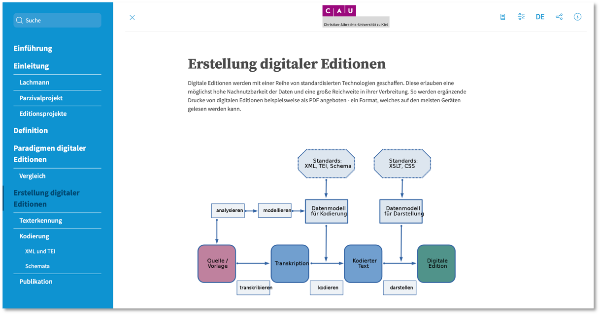
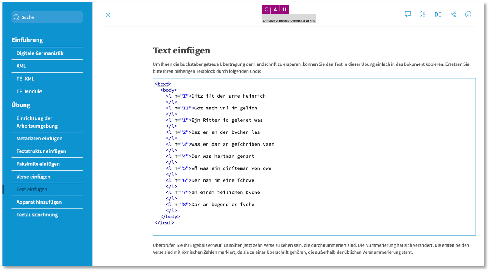
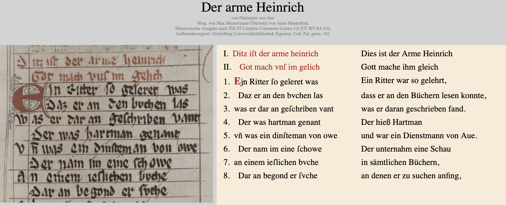
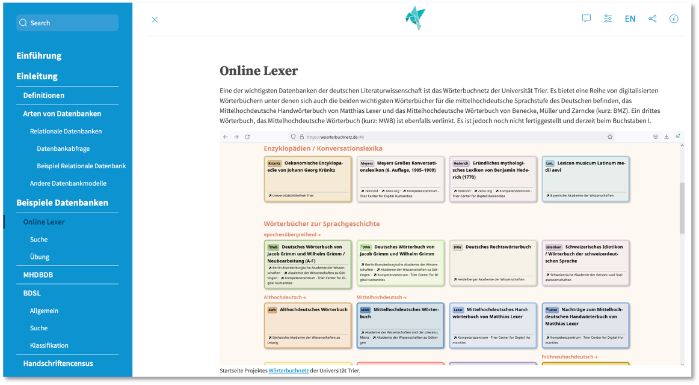

<!--
author:   Britta Petersen, Richard Diebel

email:    b.petersen@rz.uni-kiel.de

icon: images/Logo_cau-norm-de-lilagrey-rgb-0720_2022.png

version:  0.1.0

language: en

narrator: Englisch Female

comment:  Presentation during Liascript User Symposium, 06.12.2023

tags:     research data, research data management, e-learning, digital teaching, networking, digital humanities
-->

# Developing digital learning resources on research data management and digital literacy at Kiel University

  
    Illustration Cleo Michelsen

Britta Petersen (RZ CAU) & Richard Diebel (UB CAU)

[Central Research Data Management](https://www.datamanagement.uni-kiel.de/de)

# Prijects on RDM and digital literacy at Kiel University

 <!-- width="100px" align="right" -->

>**Project 1**:
>
>[e-Learning Building Blocks for Research Data Management (eLBB4RDM)](https://www.datamanagement.uni-kiel.de/de/aktivitaeten/projekte/Projekt%20eLBB4RDM)

>**Project 2:**
>
>[Bausteine für die digitale Lehre in den Geisteswissenschaften (Building blocks for digital teaching in the humanities)](https://www.datamanagement.uni-kiel.de/de/aktivitaeten/projekte/Projekt_DH-Bausteine)

>* both projects funded by [CAU Programm für digitale Lehre 2021-2023](https://www.qe.uni-kiel.de/de/lehrentwicklung/programm-fuer-die-digitale-lehre-2021-2023/programm-fuer-die-digitale-lehre-2021-2023)
>
>
>* **Project 1** -> RDM topics, generic orientation
>
>* **Project 2** -> digital literacy topics, subject-specific orientation
>
>* **In practice**: Use of common technical foundations and infrastructures, continuous exchange, joint development of materials and course concepts.

## Some goals of both projects

 <!-- width="100px" align="right" -->

* Interdisciplinary, **collaborative development** of e-learning modules for students on the subject area of RDM and Digital Literacy.

  * eLearning modules should cover **basics** and **should be expandable** to include subject-specific content (tasks, application examples).

* Development of accompanying didactic material: description of possible application scenarios, suggestions for subject-specific additions (e.g. tasks, application examples)

* Dissemination of results and experiences

* **Provision of developed materials as OER**

# Why LiaScript?

{{0}}
********************************************************************************

********************************************************************************

{{1}}
********************************************************************************
**Reasons to be cheerful**

* Open Source
* Collaborative work possible
* Versioning possible
* Easy to extend an to reuse
* Metadata includable
* Interoparable
* Can be used in different representations
* Includes features like text-to-speech
* ...

********************************************************************************

# Selected activities

 <!-- width="300px" align="center" -->

## Project seminar on digital history

  
>
***Use of LiaScript to let students create their own learning content***

---

{{1-2}}
******************

* **Format**: Project seminar in the Master's programme
* **Developed and conducted by**: Dr. Swantje Piotrowski and Britta Petersen
* **Aim(s)**:

  * Teaching key digital skills
  * Establishment of a teaching-learning format to promote research-based learning in history programmes
  * Acquisition of job-related skills (work in schools, archives, libraries and research institutions)

* **Conducted**: WS 23/23
* **Required performance**: Content development and technical realization of a digital learning module on a self-chosen topic from the field of "RDM" or "Digital Literacy"

******************

{{2-3}}
******************

**Course overview**

******************

{{3}}
******************

-> Let's take a quick look at a student output:

[Jessika Stiefken: Digitale Literaturrecherche](https://liascript.github.io/course/?https://raw.githubusercontent.com/RDM4CAU/TestModules/main/literaturrecherche/digitaleliteraturrecherche.md#1)

******************

## Digital editions

Supplements academic teaching with an introduction to digital editions: Introduction, definition, paradigms and technologies.

## Introduction to TEI XML

Provides an introduction to XML and TEI. In the practical exercise, a Middle High German text is created in TEI. The exercise is possible with laptops and tablets in the seminar.

## Grammar

Explains basic aspects of databases and introduces important databases in German medieval studies.

# All interested parties welcome!!

 <!-- width="100px" align="right" -->

> People who are interested in using our modules, in contributing to further developing materials and/or further exchange are very welcome!

## Thanks to people involved!

 <!-- width="100px" align="right" -->

* Prof. Dr. Nicola Fohrer & Dr. Georg Hörmann, Institute for Natural Resource Conservation
* Prof. Martina Gerken & Michael Meisser, Department of Electrical and Information Engineering
* Gregor Große-Bölting, Department of Computer Science
* Johannes Labrenz, Life Sciences
* Dr. Stefan Kratzenstein, Institute for Sports Science
* Prof. Dr. Oliver Nakoinz, Pre- and Protohistoric Archaeology
* Thilo Paul-Stüve, Central RDM
* Markus Alber, elk.Medien
* Andreas Christ, Central RDM
* Swantje Piotrowski, History
* Richard Diebel, Library/German studies

**Involved students:**

* Cleo Michelsen (LA Biology/Geographie)
* Semih Acis (Computer Science)
