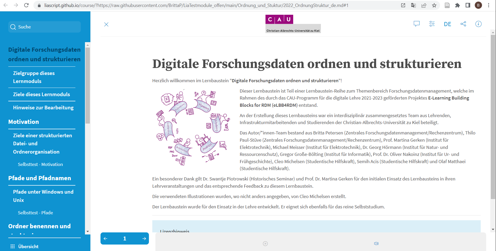
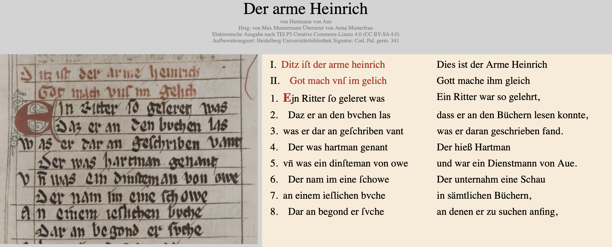

<!--
author:   Britta Petersen, Richard Diebel

email:    b.petersen@rz.uni-kiel.de

icon: images/Logo_cau-norm-de-lilagrey-rgb-0720_2022.png

version:  0.1.0

language: de

narrator: Deutsch Female

comment:  Vernetzungsveranstaltung | FDM in Studium und Lehre Landesinitiative fdm.nrw, 26.04.2023

tags:     Forschungsdaten, Forschungsdatenmanagement, FDM, e-Learning, digitale Lehre, Vernetzung
-->

# Digitale Lernbausteine zu FDM und Digital Literacy an der CAU

  
    Illustration Cleo Michelsen

Britta Petersen (RZ CAU) und Richard Diebel (UB CAU)

# e-Learning Bausteine zu FDM und Digital Literacy an der CAU

 <!-- width="100px" align="right" -->

>**Projekt 1**:
>
>e-Learning Building Blocks for Research Data Management (eLBB4RDM)

>**Projekt 2:**
>
>Bausteine für die digitale Lehre in den Geisteswissenschaften

>* Beide Projekte sind gefördert vom im Rahmen des [CAU Programms für digitale Lehre 2021-2023](https://www.qe.uni-kiel.de/de/lehrentwicklung/programm-fuer-die-digitale-lehre-2021-2023/programm-fuer-die-digitale-lehre-2021-2023)
>
>* Laufzeit: 1. Juni 2021 31.12.2023
>
>* **Projekt 1** -> generische Ausrichtung
>
>* **Projekt 2** -> fachbezogende Ausrichtung
>
>* **In der Praxis**: Nutzung gemeinsamer technischer Grundlagen und Infrastrukturen, kontinuierlicher Austausch und Absprachen, gemeinsame Entwicklung von Materialien und Lehrveranstaltungskonzepten

# Ziele des Projektes elBB4RDM

 <!-- width="100px" align="right" -->

* Interdisziplinäre, kollaborative Entwicklung von generischen e-Learning-Bausteinen für Bachelor- und Masterstudierende zum Themenspektrum FDM.

    * eLearning Bausteine sollen generische FDM Grundlagen abdecken und um fachspezifische Inhalte (Aufgaben, Anwendungsbeispiele) erweiterbar sein.

* Entwicklung von didaktischem Begleitmaterial: Beschreibung von möglichen Einsatzszenarien, Anregungen für fachspezifische Ergänzungsmöglichkeiten (z. B. Aufgabenstellungen, Anwendungsbeispiele)  
* Dissemination von Ergebnissen und Erfahrungen
* Bereitstellung entwickelter Materialien als OER

# Beteiligte am Projekt elBB4RDM

 <!-- width="100px" align="right" -->

{{1-2}}
********************************************************************************

**Mitantragstellende Projektpartner\*innen und Fachbereiche:**

* Prof. Dr. Nicola Fohrer und Dr. Georg Hörmann, Natur- und Ressourcenschutz
* Prof. Martina Gerken und Michael Meisser, Elektrotechnik
* Gregor Große-Bölting, Informatik
* Johannes Labrenz, Biowissenschaften
* Dr. Stefan Kratzenstein, Sportwissenschaften
* Prof. Dr. Oliver Nakoinz, Ur- und Frühgeschichte
* Thilo Paul-Stüve, Zentrales FDM

********************************************************************************

{{2-3}}
********************************************************************************

**Kooperationspartner\*innen:**

* Markus Alber, elk.Medien
* Andreas Christ, Universitätsbibliothek
* **Projekt: Bausteine für die digitale Lehre in den Geisteswissenschaften**

  * *Swantje Piotrowski, Historisches Seminar*
  * *Richard Diebel, Germanististisches Seminar*

********************************************************************************

{{3-4}}
********************************************************************************

**Beteiligte Studierende:**

* Cleo Michelsen (LA Biologie/Geographie)
* Semih Acis (Wirtschaftsinformatik)
* (Olaf Matthaei (LA Sport/Englisch))

********************************************************************************

# eLBB4RDM-Ansatz: Bausteinsystem

 <!-- width="80%" -->

# Aktivitäten eLBB4RDM

 <!-- width="100px" align="right" -->

{{0-1}}
********************************************************************************

**Projektstart**

* **Kick-Off Meeting**, Juni 2021
* Akquise von Hilfskräften, Juni – August 2021

---

**Ab September 2021**

* Regelmäßige Projektmeetings

  * Austausch zu technischen Umsetzungsmöglichkeiten, Testung und Auswahl von LiaScript
  * Einarbeitung in LiaScript und Git
  * Erarbeitung erster Inhalte

********************************************************************************

{{1-2}}
********************************************************************************

**Workshops**

* Workshop **Train-the-Trainer zum Forschungsdatenmanagement**, Katarzyna Biernacka (HU Berlin), September 2021

* **Mehrere Projektworkshops**: Sammlung relevanter Themenaspekte / Formulierung von Lernzielen -> Beitrag zur Entwicklung der "Lernzielmatrix zum Themenbereich Forschungsdatenmanagement (FDM) für die Zielgruppen Studierende, PhDs und Data Stewards": https://zenodo.org/record/7034478#.Y2zr7XbMJPY, Oktober und November 2021

* Workshop **Erstellung von interaktiven, offenen Online-Kursen mit LiaScript** :-), Prof. Sebastian Zug (TU Freiberg) & André Dietrich, Mai 2022

********************************************************************************

{{2-3}}
********************************************************************************

**Pilotierung eines ersten Bausteins**

* Pilotierung eines ersten Bausteins "**Digitale Forschungsdaten ordnen und strukturieren**" in Lehrveranstaltungen der Geschichtswissenschaften (Dr. Swantje Piotrowski) sowie der Elektrotechnik (Prof. Dr. Martina Gerken) im Sommersemester 2022

  - Einsatz in den Geschichtswissenschaften -> Bearbeitung innerhalb der Lehrveranstaltungen
  - Einsatz in der Elektrotechnik -> freiwillige Hausaufgabe

* Auswertung der Evaluierung und Überarbeitung des Bausteins.

********************************************************************************

{{3-4}}
********************************************************************************

**Weiterer Einsatz des Pilotmaterials**

* Begleitung von Lehrveranstaltungen im WS 2022/23 (Elektrotechnik, Biologie) sowie Erarbeitung weiterer Inhalte, erneuter Einsatz des Bausteins "**Digitale Forschungsdaten ordnen und strukturieren**"
* Gemeinsame Konzeption und Durchführung des [**Projektseminars zur Geschichte der Neuzeit**](https://univis.uni-kiel.de/form?__s=2&dsc=anew/lecture_view&lvs=philos/histor/zentr/projek_1&anonymous=1&founds=philos/histor/zentr/aufbau_8,/bungim_94,/projek,/projek_1&nosearch=1&ref=main&sem=2022w&__e=341) (Projekt Modulare Bausteine für die digitale Lehre in den Geisteswissenschaften; Dr. Swantje Piotrowski) unter Nutzung des [Cloulab](https://cloudlab.rz.uni-kiel.de/) der CAU im WS 2022/23

********************************************************************************

{{4-5}}
********************************************************************************

**Dissemination (Auswahl)**

* Vorstellung des Projektes auf dem Jour Fix der Landesinitiative fdm.nrw, März 2022
* Beteiligung an der Erarbeitung der "Lernzielmatrix zum Themenbereich Forschungsdatenmanagement (FDM) für die Zielgruppen Studierende, PhDs und Data Stewards": https://zenodo.org/record/7034478#.Y2zr7XbMJPY
* Gemeinsame Veranstaltung beider Projekte: Sprechstunde zum Datenmanagement in Studium, Lehre und Forschung - Modulare Lehrbausteine in LiaScript im Rahmen der LoveDataWeek 2023

********************************************************************************

## Evaluation Pilotmaterial

Rückmeldungen zum Baustein "Forschungsdaten ordnen und strukturieren"

### Offene Rückmeldungen: Hilfreiche Inhalte

***Ich als Teilnehmende\*r empfand folgende Inhalte des Moduls als hilfreich:***

 <!-- width="100px" align="right" -->

- Der Inhalt selbst (also zur Datenorganisation) ist zweifellos sehr hilfreich. Auch die Idee der Lernüberprüfung durch Ankreuzen hilft sehr dabei sicherzustellen, dass man das gelesene auch ein wenig durchdrungen hat.
- Die Hinweise, wie vermieden werden kann eine Hausarbeit kurz vor Abgabe zu löschen, waren sehr hilfreich und haben mich zum Nachdenken angeregt. Der Baustein hat mich motiviert meine Datensicherungen zu checken und zu überarbeiten.
- Insbesondere die Strukturierung von Hausarbeiten etc., da ich selbst öfter mal das Problem hatte nicht die richtige finale Arbeit abgeschickt zu haben, weil ich nicht richtig geordnet habe.
- Die Quizfragen und das Arbeitsmaterial am Ende des Kurses.

### Offene Rückmeldungen: Verbesserungsvorschläge

***Ich als Teilnehmende\*r habe folgende Verbesserungsvorschläge für diese e-Learning-Einheit:***

 <!-- width="100px" align="right" -->

- Studienanfängern das Modul zeigen. Wer bis jetzt noch keine Ordnerstruktur hat, wird es vermutlich auch nicht mehr ändern.
- Auf die Apple User und deren Verzeichnissystem noch mal eingehen.
- Weniger textlastige Einheiten und mehr Interaktion.
- Eventuell ein bisschen weniger Umfang oder eine abschließende kurze Zusammenfassung mit den wichtigsten Punkten (muss auch nicht ausführlich sein).
- Weniger kleinschrittig

# Technische Umsetzung

{{1}}
********************************************************************************

********************************************************************************

{{2}}
********************************************************************************
**LiaScript**: https://liascript.github.io/

********************************************************************************

# Einbindungsmöglichkeiten in Olat

{{0-1}}
********************************************************************************

**Scorm Lernbaustein**

********************************************************************************

{{1-2}}
********************************************************************************

********************************************************************************

{{2-3}}
********************************************************************************

********************************************************************************

{{3-4}}
********************************************************************************

********************************************************************************

# Teil II - Beispiel

## Ziele und Zielgruppen

**Vermittlungsziele:**

- Entwicklung eines modularisierten Baukastensystems in Lehrveranstaltungen, um Studierenden allgemeine digitale Fähigkeiten anhand fachspezifischer Inhalte zu vermitteln
- durch Synthese digitaler Methodik und fachlichen Kompetenzen erhalten Studierende zukunftsorientierte Schlüsselqualifikationen für Forschung und Lehramt

**Zielgruppen:**

- ca. 4.700 Studierende (BA + MA) Geschichte und Germanistik
- Lehrende der Fachdisziplinen Geschichte und Germanistik

## Bausteine

**Generische Inhalte:**

- Kollaboratives Arbeiten 
- Literaturrecherche
- Hausarbeiten
- Chat GPT
- CC-Lizenzen und Urheberrechte
- Open Source / Open Data
- Ethik

**Fachspezifische Inhalte:**

- Digitale Editionen
- Einführung in TEI XML
- Datenbanken in der Germanistik

## Digitale Editionen

Ergänzt die fachwissenschaftliche Lehre mit einer Einführung in digitale Editionen: Einführung, Definition, Paradigmen und Technologien

## Einführung in TEI XML

Führt in XML und TEI ein. In der praktische Übung wird ein mittelhochdeutscher Text in TEI erstellt. Die Übung ist mit Laptops und Tablets im Seminar möglich.

## Datenbanken

Erklärt grundsätzliche Aspekte von Datenbanken und führt in wichtige Datenbanken der germanistischen Mediävistik ein.

## Perspektive

**Sommersemester 2023**

- TEI XML Einführung Teil 2 in der Einführung in die germanistische Mediävistik
- Edition des niederdeutschen Dramas "Slennerhinke" aus dem 17. Jh.

**Weitere Kooperationen**

- Skandinavistik
- Philosphie
- Literaturverwaltung
- Open Access

# Interessierte willkommen!

 <!-- width="100px" align="right" -->

> Menschen, die Interesse der Nutzung unserer Bausteine, an der Mit- und Weiterentwicklung von Materialien und/oder weiteren Austausch haben, sind sehr herzlich willkommen!
>
>**b.petersen@rz.uni-kiel.de**
>**diebel@ub.uni-kiel.de**

